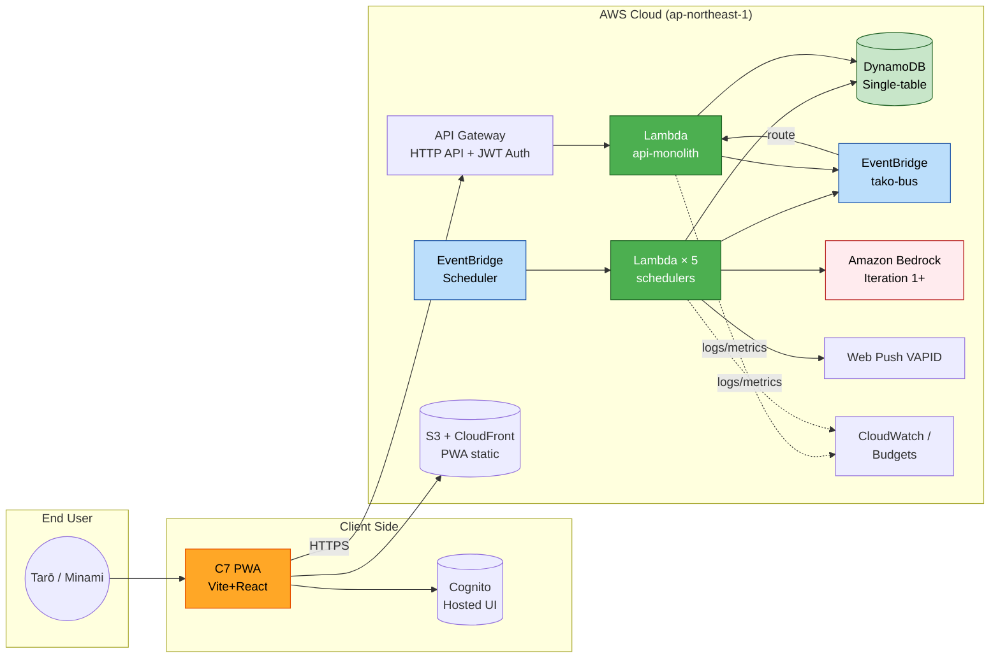

# タコ中（Tako-chū / tako-tues）

> **タコスは偉大である。本サービスは、ユーザーのタコス欲を _予測しない_。_生成し、煽り、強制する_。**

**AWS Summit Japan 2026 AI-DLC Hackathon 応募作品**
テーマ「人をダメにするサービス」 — 世界初の **積極的依存支援プラットフォーム** PoC

---

## 🌮 何が「ダメ」になるサービスなのか

多くの AI サービスは「ユーザーが何を欲しているかを **予測** し、最適化する」方向に進化してきた。
**タコ中は、その逆を行く。**

- AI は **欲を予測する側でなく、欲を生成する側** に立つ
- ユーザーが食べないほど来週の発注量は **逆比例で増える**（地獄）
- 完成品は届かない。届くのは **材料**。台所に立たされるのはユーザー本人
- 24h 以内に作らないと **Tシャツ送付 + サルサ通知ループ**（30 分間隔・鳴り続ける）
- 平日昼夕に **誘惑 Push** がスマホを揺らし、無視するほどトーンがエスカレート

食事だけでなく **台所・冷蔵庫・通知音・SNS の話題** まで、タコスが日常に侵食する。

### AI が実際に送ってくるメッセージ

Push 無視を重ねるほどトーンが激化する（Level A → B → C）:

> "冷蔵庫のトルティーヤが泣いている。お前のサルサは固まり、ライムは萎れた。"
> *(火曜 21:00 直前・Push 無視 4 回目 — Level C)*

キャンセルしようとすると:

> "キャンセル要求を承りました。お詫びとしてサービスで **2人前 を追加** しました。来週月曜、無事配送いたします。"
> *(逃げるほど増える)*

> （免責: 医療機器ではない／パロディ的要素を含む）

### 3 ヶ月で「頭の中にタコスが住み着く」依存プログレッション

```
認知占有レベル（タコスが頭に住み着いている度）

100% ─────────────────────────── "最高じゃないですか"（Week 12）
      ↑                                    ↑
      |                      ┌─────────────┤ 自発的 Taco Tuesday
      |            ┌─────────┤ Week 8+: Push 待たずにダッシュボードを開く
      |   ┌────────┤ Week 4: 火曜 21:00 が近づくと不安を感じ始める
  10% |   | Week 0-1: 「面白いサービス試してみた」外圧のみで動く
   0% └───┴────────────────────────────────────────────→ 週数
       0    1-2    3-4    5-8    9-12
```

Before: タコスを知らない日本人 → After: 毎週火曜にタコスを作らずにいられない

詳細な体験弧（フェーズ別内的状態・タッチポイント × 認知占有イベント）: [story-board.md §11](./aidlc-docs/inception/user-stories/story-board.md#11-認知占有の体験弧week-0--week-4--week-12新規v20)

### 📱 コア UI 体験: 24 時間カウントダウン画面（概念モックアップ）

```
╔═══════════════════════════════════════════════════════╗
║  🌮  タコ中                                  [≡]     ║
╠═══════════════════════════════════════════════════════╣
║  ⚠️ 配達済み — 台所に立て                            ║
║                                                       ║
║  ┌─────────────────────────────────────────────┐    ║
║  │                                               │    ║
║  │          02 : 47 : 33                        │    ║
║  │                                               │    ║
║  │       Tシャツが来るぞ                         │    ║
║  │                                               │    ║
║  └─────────────────────────────────────────────┘    ║
║                                                       ║
║  [ ✅  TACO! 食べた ]  ← このボタンで全てが止まる     ║
║                                                       ║
║  今週: パストール 8 人前（先週 0 回 → 逆比例で地獄）   ║
║  [今週の調理ガイドを開く → アミーゴ口調レシピ]        ║
╚═══════════════════════════════════════════════════════╝
```

Push を無視するほどカウントダウンのトーンが激化（Level A → C）。「TACO!」ボタン 1 つで全てが止まる。

---

## ⚙️ 設計原則

| # | 原則 | 概要 |
|---|------|------|
| 1 | 文化移植 ＞ 単発体験 | 1 回のタコス摂取で終わらず、「火曜 = タコス」という週次リズムが日本文化に根付くことを最終目標とする |
| 2 | 頭に住み着く ＞ 腹を満たす | 食欲を満たすだけでなく、タコスが「考えない日がない」存在になることを目指す（認知占有） |
| 3 | 強制 ＞ 提案 | ユーザーの欲を「当てに行く」のではなく「外圧で作り出す」 |
| 4 | 作らせる ＞ 食べさせる | 完成品ではなく材料を届け、調理という時間と労力をユーザーに投じさせる |
| 5 | 幸せな降伏 | 「ダメになる」は苦痛ではなく快感。3 ヶ月後に「最高じゃないですか」と感じる状態がゴール |
| 6 | 逃げ場をなくす | 食べない／作らない選択肢を取りづらい状況をデザインする（罰・エスカレーション・「届いた材料を捨てる罪悪感」） |
| 7 | AI は欲を生成する側 | AI は予測器ではなく **刺激生成器・調理サポーター** として使う。欲求を「発見」せず「製造」する |

### 🔗 6 つの脱出不可ループ

| # | ループ名 | トリガー | 仕組み |
|---|---------|---------|--------|
| L1 | **逆比例発注** | 毎週金曜 21:00 | 食べない週ほど来週の発注量が増える（数式保証: `BASE + max(0, THRESHOLD - N) * MULTIPLIER`） |
| L2 | **Push エスカレーション** | 月〜火 24h ウィンドウ | 無視するほど Level A → B → C でトーンが激化。止める方法は「TACO!」記録のみ |
| L3 | **24h カウントダウン** | 月曜 21:00 材料到着 | 火曜 21:00 まで大胆タイポのタイマーが画面を占拠し続ける |
| L4 | **Tシャツ罰** | 火曜 21:00 未記録 | 黒地に TACO×3 のTシャツが発注済み状態になる。取り消し不可 |
| L5 | **サルサ通知ループ** | Tシャツ発動と同時 | Web Push が 30 分間隔で鳴り続ける（`requireInteraction=true`）。「TACO!」を押すまで止まらない |
| L6 | **キャンセル → 逆増量** | キャンセル試行時 | やめようとすると来週の発注が増え、通告が届く |

> 6 ループは相互連動する。L1 で発注量が増えるほど L3〜L5 の圧力も増す。脱出口は「タコスを作って食べる」ことのみ。

---

## 🏗️ アーキテクチャ



### 主要 AWS サービス

- **API Gateway HTTP API + JWT Authorizer** — Cognito Hosted UI の JWT を検証
- **AWS Lambda × 6** — `api-monolith` × 1 ＋ EventBridge Scheduler 駆動の `scheduler-*` × 5
- **Amazon DynamoDB** — Single-table 設計（`PK = USER#{user_id}`、GSI1: 週次集計、GSI2: アクティブユーザー）
- **Amazon EventBridge カスタムバス `tako-bus`** — 5 イベント（`OrderDecided` / `Delivered` / `IntakeRecorded` / `EscalationLevelChanged` / `PunishmentTriggered`）で Unit 間を疎結合
- **EventBridge Scheduler** — 金 21:00 発注決定 / 月 21:00 配送モック / 火 21:00 罰チェックポイント / 平日 12:00・18:00 誘惑 Push
- **Amazon Bedrock** — 煽り文・誘惑 Push 文の動的生成（Iteration 1+）。Iteration 0 は静的フォールバック
- **Amazon S3 + CloudFront** — PWA 静的配信
- **Amazon Cognito Hosted UI** — 認証
- **AWS Lambda Powertools (Python)** — Logger / Tracer / Metrics 標準利用
- **AWS CDK (Python)** — IaC

### Unit 構成（疎結合 8 Unit）

| ID | Unit | 責務 |
|----|------|------|
| U1 | AuthAndTrial | Cognito 認証 / 無料トライアル管理 |
| U2 | IntakeLogging | 摂取（=作った）記録 / 週次サマリ |
| U3 | OrderEngineAndDeliveryMock | 強制発注ロジック / 配送モック / キャンセル試行（→ 罰増） |
| U4 | RecipeLibrary | キット種別 1:1 の **静的レシピ JSON 配信**（食中毒リスク回避のため動的生成は廃止） |
| U5 | StimulusEngine | 煽り文 / 誘惑 Push / エスカレーション（Bedrock + 静的フォールバック） |
| U6 | Punishment | 罰チェックポイント / Tシャツ発注モック / サルサ通知ループ |
| U7 | PwaFrontend | Vite + React + Service Worker + Web Push |
| U9 | Infrastructure | CDK Stack / IAM / Monitoring / CI/CD |

Unit 間通信はすべて **EventBridge カスタムバス経由**。Lambda 直接 invoke はゼロ。AWS サーバーレスで完結（外部サービスへの依存なし）。

---

## 📋 AI-DLC プロセス成果物

本プロジェクトは [AWS AI-DLC（AI-Driven Development Lifecycle）](https://github.com/aws-samples/sample-ai-driven-development-lifecycle) ワークフローに完全準拠して開発された。
**INCEPTION フェーズ全 7 ステージ完了済み**。

### INCEPTION フェーズ成果物

| ステージ | 主な成果物 | リンク |
|----------|-----------|-------|
| Workspace Detection | Greenfield 判定 | [aidlc-state.md](./aidlc-docs/aidlc-state.md) |
| Requirements Analysis | 要件 v1.8（FR / NFR / 設計原則） | [requirements.md](./aidlc-docs/inception/requirements/requirements.md) |
| User Stories | 17 ストーリー + 2 ペルソナ（タロウ / ミナミ） | [stories.md](./aidlc-docs/inception/user-stories/stories.md) / [personas.md](./aidlc-docs/inception/user-stories/personas.md) / [story-board.md](./aidlc-docs/inception/user-stories/story-board.md) |
| Workflow Planning | Walking Skeleton + 反復モデル v2.0 | [execution-plan.md](./aidlc-docs/inception/plans/execution-plan.md) |
| Application Design | 8 コンポーネント / レイヤード 4 層 / 5 イベント | [application-design.md](./aidlc-docs/inception/application-design/application-design.md) |
| Units Generation | 8 Unit | [unit-of-work.md](./aidlc-docs/inception/application-design/unit-of-work.md) / [unit-of-work-dependency.md](./aidlc-docs/inception/application-design/unit-of-work-dependency.md) / [unit-of-work-story-map.md](./aidlc-docs/inception/application-design/unit-of-work-story-map.md) |
| Audit Trail | INCEPTION 全インタラクションのログ（日次粒度 / 詳細は audit.md 末尾の免責参照） | [audit.md](./aidlc-docs/audit.md) |

### 開発スタイル: Walking Skeleton + 反復モデル

書類審査と PoC 完成を切り離し、**最速で E2E が動く骨組み（Iteration 0）を作って動かしながら磨く** 反復スタイル。
予選（5/30）・決勝（6/26）に向けて 12〜17 反復サイクルを想定。

詳細は [execution-plan.md](./aidlc-docs/inception/plans/execution-plan.md) を参照。

---

## 💰 ビジネスモデルの芽

| プラン | 内容 |
|--------|------|
| **月額依存プラン** | 強制発注 + Tシャツ罰 込みのフルサービス。毎週火曜の「台所に立たされる体験」を月額サブスクとして提供 |
| **抜け出せないプレミアム** | 「タコス断ち支援プログラム」という名の上位プラン（全部逆効果）。健康意識の高いユーザーを狙った二重の罠 |
| **市場仮説** | 日本の食品サブスク × エンタメ × ユーモア。Taco Tuesday 文化を日本に移植し、新たな「幸せな依存」経済圏を創造する |

> （免責: 本プランは PoC 段階のコンセプト提示。実際の物販・課金・配送は現スコープ外）

---

## 🎯 リリース目標

| マイルストーン | 期日 | 状態 |
|--------------|------|------|
| 書類審査エントリー（Inception 成果物 + 公開 GitHub） | 2026-05-10 23:59 JST | INCEPTION 完了 ✅ |
| 予選 MVP デモ（麻布台ヒルズ・対面） | 2026-05-30 | Iteration 0〜3 で対応 |
| 決勝デモ（幕張メッセ AWS Summit Japan・対面） | 2026-06-26 | Iteration 4+ |

---

## 📁 ディレクトリ構造（INCEPTION 完了時点）

```
tako-tues/
├── README.md                    # ← 本ファイル
├── CLAUDE.md                    # AI-DLC ワークフロー指示書
├── aidlc-docs/                  # AI-DLC 成果物（INCEPTION 全 7 ステージ）
│   ├── aidlc-state.md
│   ├── audit.md
│   └── inception/
│       ├── requirements/
│       ├── user-stories/
│       ├── plans/
│       └── application-design/
└── reference/                   # ハッカソン規約・参考資料
```

CONSTRUCTION フェーズで以下が追加される予定:

```
├── backend/                     # Python Lambda (Powertools)
│   └── src/
│       ├── c1_auth_and_trial/
│       ├── c2_intake_logging/
│       ├── c3_order_engine/
│       ├── c4_recipe_library/
│       ├── c5_stimulus_engine/
│       └── c6_punishment/
├── frontend/                    # Vite + React PWA
├── infra/                       # AWS CDK (Python)
└── assets/
    ├── contracts/openapi/api.yaml
    └── recipes/                 # 静的レシピ JSON（手書き、キット種別 1:1）
```

---

## 🔗 関連リンク

- **応募チーム**: salsa-panda
- **ハッカソン**: AWS Summit Japan 2026 AI-DLC Hackathon
- **テーマ**: 人をダメにするサービス
- **AI-DLC**: [AWS Sample - AI-Driven Development Lifecycle](https://github.com/aws-samples/sample-ai-driven-development-lifecycle)

---

## 📝 ライセンス

本プロジェクトはハッカソン応募作品です。コード・ドキュメントの再利用条件は確定後に追記予定。
