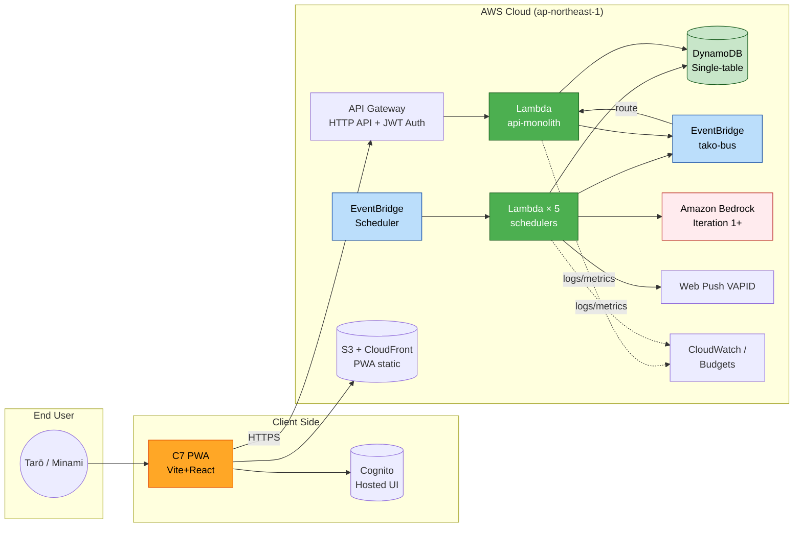

# Application Design (Consolidated): タコ中

**Project**: タコ中 (Tako-chū / Tako-tues)
**Document Version**: 1.1
**Created**: 2026-04-29
**Updated**:
- 2026-05-08 v1.1: 要件 v1.8 反映。**FR-6.3 廃止に伴い C8 ChatGPTGptAsset コンポーネント削除**（9 → 8 コンポーネント）。アーキテクチャ図から OpenAI ChatGPT GPTs ノード削除、Iteration 0 範囲一覧から「ChatGPT GPT (C8)」行削除、FR Coverage Matrix から FR-6.3 行削除
**Phase**: INCEPTION - Application Design
**Inputs**:
- requirements.md v1.8
- stories.md v1.4
- story-board.md v1.4
- execution-plan.md v1.4
- application-design-plan.md v1.0（12 問 + 2 follow-up 全て解決済み）

---

## 0. このドキュメントの位置付け

Application Design ステージの全成果物（components.md / component-methods.md / services.md / component-dependency.md）を**統合した参照ドキュメント**。
詳細はそれぞれの個別ファイルを参照してください。本書は概要・決定事項・トレーサビリティの 1 枚地図として機能する。

---

## 1. 設計決定サマリー（Q1〜Q12 + 2 follow-up）

| # | 質問 | 決定 |
|---|------|------|
| Q1 | コンポーネント粒度 | **9 コンポーネント（C1〜C9）／うち 8 Unit + Documentation 1**（v1.1 で C8 GPT を削除し 8 Unit に確定。Units Generation Q3=C で C8 は Unit 外） |
| Q2 | 横断的責務 | **AWS Lambda Powertools** 標準利用（Logger / Tracer / Metrics） |
| Q3 | API インターフェース定義 | **OpenAPI 3.x YAML** をリポジトリ同梱（`assets/openapi/api.yaml`） |
| Q4 | Bedrock 抽象化 | **`StimulusGenerator` Protocol** + `BedrockStimulusGenerator` / `StaticFallbackStimulusGenerator` の 2 実装 |
| Q5 | Lambda 関数粒度 | **C-1: api-monolith 1 + スケジューラ 5 = 計 6 関数** |
| Q6 | EventBridge イベント | **5 件で OK**（OrderDecided / Delivered / IntakeRecorded / EscalationLevelChanged / PunishmentTriggered） |
| Q7 | DynamoDB データモデル | **Single-table + レシピは静的 JSON**（Lambda bundle） |
| Q8 | 通信パターン | **EventBridge 主 + DynamoDB Streams 補助**（Iteration 1+） |
| Q9 | 設計スタイル | **レイヤード**（Handler / UseCase / Repository / External の 4 層） |
| Q10 | PWA フレームワーク | **Vite + React** |
| Q11 | Iteration 0 の Bedrock | **完全フォールバック**（Static 実装のみ、Bedrock は Iteration 1+） |
| Q12 | レシピ JSON Schema | **最小型から開始**、Iteration 1+ で Pydantic 化 |

---

## 2. 9 コンポーネント早見表

| ID | 名前 | 責務 | Lambda 関数 | Iteration 0 |
|----|------|------|-----------|-------------|
| C1 | AuthAndTrial | Cognito 認証 / トライアル管理 | api-monolith 内 | ✅ 認証経路のみ |
| C2 | IntakeLogging | 摂取記録 / 週次サマリ | api-monolith 内 | ✅ |
| C3 | OrderEngineAndDeliveryMock | 強制発注 / 配送モック / キャンセル試行 | api-monolith + scheduler-friday + scheduler-monday | ✅ 最小ロジック |
| C4 | RecipeLibrary | 静的レシピ取得（キット種別 1:1） | api-monolith 内 + Lambda bundle JSON | ✅ レシピ 2-3 種 |
| C5 | StimulusEngine | 煽り文 / 誘惑 Push / エスカレーション | api-monolith + scheduler-lunch + scheduler-evening | ⚠️ 1 日 1 回 + Static のみ |
| C6 | Punishment | 罰チェックポイント / Tシャツ / サルサ | api-monolith + scheduler-tuesday | ✅ 罰 1 回まで |
| C7 | PwaFrontend | Vite + React SPA + Service Worker + Web Push | （Lambda 外）S3 + CloudFront | ⚠️ 3 画面 |
| ~~C8~~ | ~~ChatGPTGptAsset~~ | ~~ChatGPT GPT System Prompt 配布~~ | — | **v1.1 で削除**（FR-6.3 廃止） |
| C9 | Infrastructure | CDK Stack 群 / IAM / Monitoring / CI/CD | （Lambda 外）IaC | ✅ 単一 Stack |

詳細は [components.md](./components.md) を参照。

---

## 3. Lambda 関数構成（計 6 関数）

| # | 関数名 | トリガー | Iteration 0 |
|---|-------|---------|-------------|
| 1 | api-monolith | API Gateway HTTP API + EventBridge ルート受信 | ✅ |
| 2 | scheduler-friday-decide-order | EventBridge Scheduler `cron(0 21 ? * FRI *)` | ✅ |
| 3 | scheduler-monday-deliver | `cron(0 21 ? * MON *)` | ✅ |
| 4 | scheduler-tuesday-checkpoint | `cron(0 21 ? * TUE *)` | ✅ |
| 5 | scheduler-weekday-stimulus-lunch | `cron(0 12 ? * MON-FRI *)` | ⚠️ |
| 6 | scheduler-weekday-stimulus-evening | `cron(0 18 ? * MON-FRI *)` | ⚠️ |

詳細は [services.md](./services.md) を参照。

---

## 4. アーキテクチャ図



---

## 5. レイヤード構造（Q9=A）

各コンポーネント（C1〜C6）は同じ 4 層構造を持つ:

```
┌──────────────────────────────────────────────┐
│  Handler 層                                  │
│  - APIGatewayHttpResolver, EventBridge handler│
│  - Powertools Logger / Tracer / Metrics       │
│  - 入力バリデーション、認可チェック             │
├──────────────────────────────────────────────┤
│  UseCase 層                                  │
│  - ビジネスロジックの主役                      │
│  - 詳細は Construction Functional Design へ   │
├──────────────────────────────────────────────┤
│  Repository 層                               │
│  - DynamoDB Single-table アクセス             │
│  - boto3 / aioboto3                          │
├──────────────────────────────────────────────┤
│  External 層                                 │
│  - Bedrock / Web Push / Cognito              │
│  - StimulusGenerator Protocol（C5）           │
└──────────────────────────────────────────────┘
```

---

## 6. 共有契約（Walking Skeleton 立ち上げ前提）

execution-plan v1.3 §5.2 で要求された契約。すべて確定済み:

1. ✅ **DynamoDB Single-table キー設計**（services.md §5.1）
2. ✅ **EventBridge イベントスキーマ**（5 件、component-dependency.md §4.2）
3. ✅ **REST API 契約**（component-methods.md §11、Construction で OpenAPI YAML 化）
4. ✅ **Web Push 通知ペイロード**（component-dependency.md §4.4）
5. ✅ **レシピ JSON Schema**（component-dependency.md §4.5、OI-14 解消）

---

## 7. Iteration 0（Walking Skeleton）の範囲

### 含めるもの（必須）

| 項目 | 詳細 |
|------|------|
| Cognito 認証 | Hosted UI、トライアル日数チェックは固定値 OK |
| TACO 記録 | POST /intakes → DynamoDB 1 行 |
| 強制発注 | 金 21:00 cron で逆比例ロジック最小実装、メニュー 2-3 種固定 |
| 配送モック | 月 21:00 cron で `decided` → `delivered` 遷移、Web Push 1 通 |
| レシピ取得 | 静的 JSON 2-3 種 + `_default.json` |
| 罰発火 | 火 21:00 cron で 24h 内に intake 無ければ Tシャツフラグ + サルサ 1 回 |
| 24h カウントダウン UI | 残時間表示 + TACO ボタン + 配送ステータスの 3 画面 |
| 単一 CDK Stack | 全リソースを 1 Stack で立ち上げ |

### 含めないもの

❌ Bedrock 動的生成（Iteration 1+）
❌ Push エスカレーション Level A→B→C（Iteration 1+）
❌ 強制バリエーションウィーク Type B（Iteration 2+）
❌ Share / 動画字幕画像（Iteration 後半）
❌ サルサ通知 30 分間隔ループ（Iteration 1+）
❌ DynamoDB Streams ハンドラ（Iteration 1+）
❌ Stack 分離 / CI/CD パイプライン（Iteration 1+）

---

## 8. FR / Story / Component トレーサビリティ

| FR | Component | 主要 Story |
|----|-----------|----------|
| FR-1.1 サルサ通知 | C6 | US-T07 |
| FR-1.2 Tシャツ罰 | C6 | US-T06, US-M05 |
| FR-1.3 摂取記録 | C2 | US-T02 |
| FR-2.1 強制発注ロジック | C3 | US-T03, US-M01 |
| FR-2.2 メニュー / Type A/B | C3 | US-T03, US-T12 |
| FR-2.3 レシピ配信 | C4 | US-T13, US-M04 |
| FR-2.4 配送モック / キャンセル | C3 | US-T04, US-M02 |
| FR-4 ダッシュボード | C7 | US-T14, US-T10 |
| FR-5 認証・トライアル | C1 | US-T01 |
| FR-6.1 煽り文 | C5 | US-T10 |
| FR-6.2 誘惑 Push | C5 | US-T08 |
| ~~FR-6.3 ChatGPT GPT~~ | ~~C8~~ | **v1.1 で削除**（要件 v1.8 で FR-6.3 廃止） |
| FR-6.4 エスカレーション | C5 | US-T09 |
| FR-6.5 生成テキスト | C5 | （横断） |
| NFR 全般 | C9 | — |

---

## 9. Open Items の引き継ぎ

| ID | ステータス | 引き継ぎ先 |
|----|-----------|-----------|
| OI-1 PBT 対象関数 | 未解決 | Construction NFR Requirements |
| OI-6〜OI-10 人/対外系 | ユーザー継続宿題 | （Application Design 範囲外） |
| OI-11 Units Generation | Workflow Planning で解消 | — |
| OI-12 / OI-13 旧（Bedrock レシピ） | v1.7 で解消 | — |
| OI-12' Bedrock 煽り文ガードレール | 部分解決（C5 抽象化で対応可） | Construction Functional Design / NFR |
| OI-13' Bedrock 煽り文コスト | 部分解決（Iteration 1+ で日次キャッシュ実装） | Construction NFR |
| **OI-14 レシピ JSON Schema** | **本ステージで解消**（component-dependency.md §4.5） | — |

---

## 10. 次ステージへの申し送り（Units Generation）

execution-plan v1.3 では 9 Unit が暫定マッピング済み（v1.4 で 8 Unit に縮減: U8 ChatGPT GPT Asset を FR-6.3 廃止に伴い削除）。Application Design ステージで:

- Unit と Component を **1:1 で対応**することが確定（Q1=A、ただし C8 は Documentation 化により Unit 外）
- Lambda 関数の粒度を **6 関数に集約**することが確定（Q5=C-1）
- **共有契約 5 件すべてが確定**したため、Walking Skeleton 立ち上げのブロッカーは無し

→ Units Generation ステージでは、**8 Unit（U1〜U7, U9）**を**正式な Construction フェーズの per-unit 単位**として確定し（v1.1 で旧 Documentation セクション/C8 GPT 廃止）、各 Unit に紐付く成果物（Functional Design / NFR Requirements / NFR Design / Infrastructure Design / Code Generation）の入力資料を準備する。

---

## 11. 参照

- [components.md](./components.md) - 9 コンポーネントの責務
- [component-methods.md](./component-methods.md) - メソッドシグネチャ
- [services.md](./services.md) - Lambda 関数 + サービス層
- [component-dependency.md](./component-dependency.md) - 依存関係 + データフロー
- [../plans/application-design-plan.md](../plans/application-design-plan.md) - 12 問 + 回答
- [../plans/execution-plan.md](../plans/execution-plan.md) - Workflow Planning v1.3
- [../requirements/requirements.md](../requirements/requirements.md) - Requirements v1.7
- [../user-stories/stories.md](../user-stories/stories.md) - User Stories v1.3
