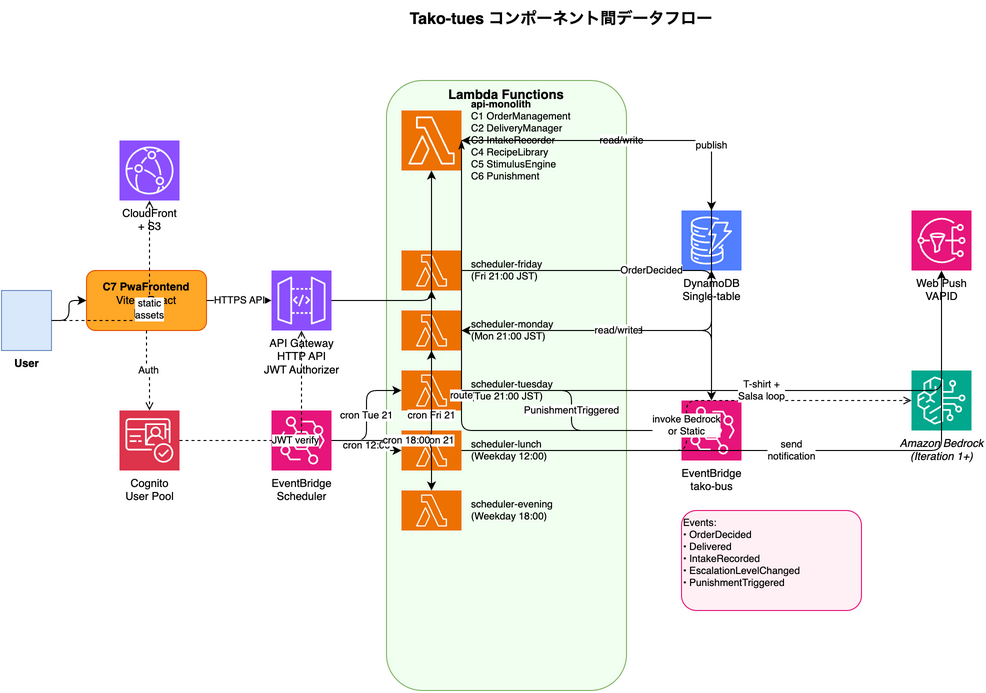
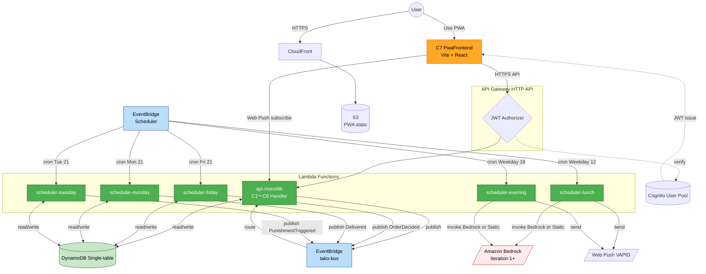
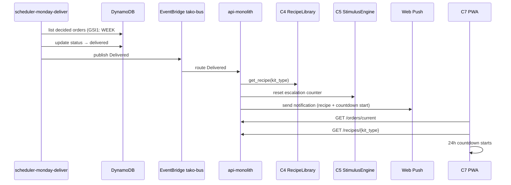
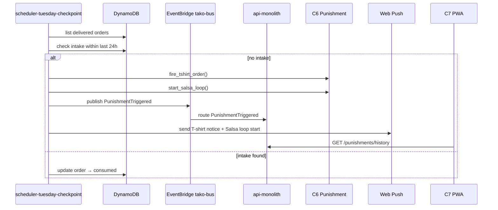
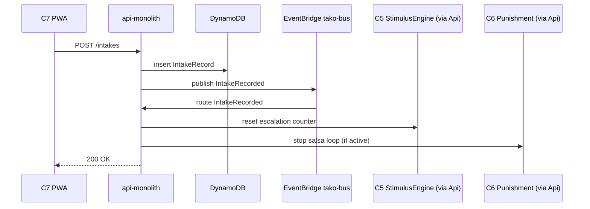

# Component Dependency: タコ中

**Project**: タコ中 (Tako-chū / Tako-tues)
**Document Version**: 1.1
**Created**: 2026-04-29
**Updated**:
- 2026-05-08 v1.1: 要件 v1.8 / components v1.1 反映。**FR-6.3 廃止に伴い C8 GPT 列・行を Dependency Matrix から削除**、Mermaid データフロー図から GPT ノード・PWA → GPT エッジ・style 行を削除、§「ChatGPT GPT 完全外部」「C8 テスト不要」「ChatGPT GPT 連携」記述を削除
- 2026-05-08 v1.1（rework v2.0 復元）: ビジネス意図の深掘り rework に伴いバックアップから復元。依存関係定義は変化なし。
**Phase**: INCEPTION - Completed (2026-04-29 承認 / 2026-05-08 v1.1 / 2026-05-09 rework 復元)

---

## 0. 設計方針

- **Unit Coupling Principles（execution-plan v1.3 §5.1）に厳密に従う**:
  - P1 イベント駆動の境界（Lambda 直接 invoke 禁止）
  - P2 共有 DB スキーマ = API 契約
  - P3 モックインターフェース先行
  - P4 Unit 単位でデプロイ可能
  - P5 テストは Unit 内で完結
- **通信パターン優先順位**: EventBridge カスタムバス（主） + DynamoDB Streams（補助、Iteration 1+） + 直接 API 呼び出し（同期のみ、PWA → API Gateway）

---

## 1. Dependency Matrix

行 = 呼ぶ側、列 = 呼ばれる側、セル = 依存方法（同期 sync / 非同期 async / 共有 shared / 静的 static / なし — ）

|      | C1 Auth | C2 Intake | C3 Order | C4 Recipe | C5 Stimulus | C6 Punish | C7 PWA | C9 Infra |
|------|---------|-----------|----------|-----------|-------------|-----------|--------|----------|
| **C1 Auth**     | —       | —         | —        | —         | —           | —         | —      | shared(Cognito) |
| **C2 Intake**   | shared(JWT) | — | —        | —         | async(IntakeRecorded) | async(IntakeRecorded) | — | shared(DDB) |
| **C3 Order**    | shared(JWT) | shared(DDB read) | —        | async(Delivered) | async(Delivered) | shared(DDB read) | async(OrderDecided) | shared(DDB, EventBus) |
| **C4 Recipe**   | shared(JWT) | — | static(KitType) | — | — | — | async(via Delivered) | shared(Lambda bundle) |
| **C5 Stimulus** | shared(JWT) | async(IntakeRecorded → reset) | shared(DDB read) | — | —           | —         | sync(GET /dashboard/stimulus) | shared(EventBus) |
| **C6 Punish**   | shared(JWT) | shared(DDB read) / async(IntakeRecorded → stop salsa) | shared(DDB read) | — | —           | —         | sync(GET /punishments/history) / async(PunishmentTriggered) | shared(EventBus) |
| **C7 PWA**      | sync(GET /me, /signup-trial) | sync(POST /intakes, GET /intakes/weekly) | sync(GET /orders/current, POST /cancel-attempt) | sync(GET /recipes/{kit_type}) | sync(GET /dashboard/stimulus) | sync(GET /punishments/history) | — | shared(CloudFront) |
| **C9 Infra**    | —       | —         | —        | —         | —           | —         | —      | —        |

> **v1.1 注**: 旧「C8 GPT」列・行は FR-6.3 廃止に伴い削除（OpenAI ChatGPT GPTs 依存をスコープから外したため）。

### 1.1 凡例

| 略号 | 意味 |
|------|------|
| **sync** | API Gateway HTTP 経由の同期呼び出し |
| **async** | EventBridge カスタムバス経由の非同期イベント |
| **shared(DDB)** | 共有 DynamoDB Single-table への読み書き（スキーマが API 契約） |
| **shared(JWT)** | API Gateway JWT Authorizer による認可（Cognito 発行のトークン） |
| **shared(EventBus)** | EventBridge カスタムバス `tako-bus` の利用 |
| **shared(Lambda bundle)** | Lambda パッケージに静的 JSON を同梱 |
| **static** | リポジトリ内の静的アセット（JSON / Markdown / URL） |
| **—** | 依存なし |

---

## 2. データフロー図

### 2.1 全体フロー（コンポーネント間）



<details><summary>Mermaid ソース（テキスト参照用）</summary>



</details>

### 2.2 ユースケース別シーケンス: 月曜夜の材料受領



### 2.3 ユースケース別シーケンス: 火曜夜の罰発火



### 2.4 ユースケース別シーケンス: TACO 記録 → 罰停止



---

## 3. 通信パターン詳細

### 3.1 同期通信（PWA → Backend）

| 用途 | プロトコル |
|------|-----------|
| 認証・読み取り・書き込み | HTTPS / API Gateway HTTP API + JWT Authorizer |
| Web Push 購読登録 | HTTPS（POST /push-subscriptions、Iteration 1+ で追加） |

### 3.2 非同期通信（Backend 内部）

| 用途 | 方式 | Iteration 0 |
|------|------|-------------|
| Unit 間状態遷移通知 | EventBridge カスタムバス `tako-bus` | ✅ 5 イベント |
| スケジュール起動 | EventBridge Scheduler（cron） | ✅ 5 スケジューラ |
| データ変更契機の派生処理 | DynamoDB Streams | ❌ Iteration 1+ |
| 失敗イベントのデッドレター | Lambda DLQ → SQS | ⚠️ ApiMonolith のみ |

### 3.3 外部通信

| 用途 | 方式 |
|------|------|
| Bedrock 呼び出し | boto3 `bedrock-runtime`（Iteration 1+） |
| Web Push 送信 | pywebpush ライブラリ + VAPID |

---

## 4. 共有契約（Shared Contracts）

> Walking Skeleton 立ち上げのため、**Application Design 完了時点で以下の契約を確定**する。これがあれば各 Unit を並行に薄く立ち上げられる（execution-plan v1.3 §5.2 で要求された項目）。

### 4.1 DynamoDB Single-table キー設計

services.md §5.1 を参照。確定済み。

### 4.2 EventBridge イベントスキーマ

```yaml
# OrderDecided
source: "tako.order"
detail-type: "OrderDecided"
detail:
  user_id: string
  week_id: string  # ISO 8601 week, "2026-W19"
  kit_type: string
  portions: integer
  is_variation_week: boolean
  decided_at: string  # ISO 8601

# Delivered
source: "tako.order"
detail-type: "Delivered"
detail:
  user_id: string
  week_id: string
  kit_type: string
  delivered_at: string

# IntakeRecorded
source: "tako.intake"
detail-type: "IntakeRecorded"
detail:
  user_id: string
  recorded_at: string
  portions: integer

# EscalationLevelChanged
source: "tako.stimulus"
detail-type: "EscalationLevelChanged"
detail:
  user_id: string
  window_id: string  # "2026-W19-DELIVERED"
  old_level: string  # "A" | "B" | "C"
  new_level: string

# PunishmentTriggered
source: "tako.punishment"
detail-type: "PunishmentTriggered"
detail:
  user_id: string
  week_id: string
  triggered_at: string
  kinds: ["tshirt", "salsa_loop"]
```

### 4.3 REST API 契約

OpenAPI 3.x YAML を `assets/openapi/api.yaml` に配置（Q3=A）。
Application Design 段階では仕様書面 component-methods.md §11 のテーブルが正、Construction Code Generation で実 YAML を生成する（Iteration 0 用に最小スキーマでスタートし、Iteration 1+ で拡張）。

### 4.4 Web Push 通知ペイロード

```typescript
type WebPushPayload = {
  title: string;
  body: string;
  icon?: string;
  badge?: string;
  tag?: string;
  requireInteraction?: boolean;  // サルサ通知ループで true
  data?: {
    url?: string;        // タップ時遷移先
    weekId?: string;
    kind?: "stimulus" | "delivered" | "punishment" | "salsa_loop";
  };
  actions?: Array<{
    action: string;
    title: string;
  }>;
};
```

### 4.5 レシピ JSON Schema（OI-14、Q12=A）

最小型から開始（Iteration 1+ で Pydantic 拡張）:

```json
{
  "$schema": "http://json-schema.org/draft-07/schema#",
  "type": "object",
  "required": ["title", "kit_type", "servings", "steps"],
  "properties": {
    "title": { "type": "string" },
    "kit_type": {
      "type": "string",
      "enum": [
        "type-a-pastor", "type-a-fish", "type-a-veg",
        "type-b-mango-week", "type-b-habanero-max", "type-b-carnitas-scratch",
        "_default"
      ]
    },
    "servings": { "type": "integer", "minimum": 1, "maximum": 20 },
    "steps": {
      "type": "array",
      "items": { "type": "string" },
      "minItems": 1
    },
    "tone": { "type": "string", "enum": ["amigo", "scolding"], "default": "amigo" }
  }
}
```

---

## 5. デプロイ単位（Unit Coupling Principle P4）

CDK Stack を以下に分割（Iteration 0 では単一 Stack、Iteration 1+ で分離）:

| Stack | 含まれるコンポーネント | 独立デプロイ可能か |
|-------|-------------------|-----------------|
| `tako-core-stack` | C9: DynamoDB / EventBridge カスタムバス / Cognito | ✅ 全 Stack の前提 |
| `tako-api-stack` | C9: API Gateway + api-monolith Lambda | ✅ |
| `tako-scheduler-stack` | C9: EventBridge Scheduler + 5 個のスケジューラ Lambda | ✅ |
| `tako-frontend-stack` | C9: S3 + CloudFront + PWA bundle | ✅（PWA ビルド前提） |
| `tako-monitoring-stack` | C9: CloudWatch / Budgets / Alarms | ✅ |

> **Iteration 0 では `tako-iteration-0-stack` 単一 Stack に集約**して立ち上げを最速化する。Stack 分離は Iteration 1 以降。

---

## 6. テスト境界（Unit Coupling Principle P5）

各コンポーネントの単体テストでカバーすべき境界:

| Component | Mock すべき外部 |
|-----------|-----------------|
| C1 Auth | Cognito（DEFAULT で moto / dummy claim） |
| C2 Intake | DynamoDB（moto）、EventBridge（boto3 stub） |
| C3 Order | DynamoDB（moto）、EventBridge（stub）、現在時刻（freezegun） |
| C4 Recipe | ファイルシステム（pyfakefs or 実 JSON テスト用） |
| C5 Stimulus | DynamoDB（moto）、EventBridge（stub）、`StimulusGenerator` Protocol（in-memory FakeGenerator）、Web Push（stub） |
| C6 Punishment | DynamoDB（moto）、EventBridge（stub）、現在時刻（freezegun）、Web Push（stub） |
| C7 PWA | 各 Component を Storybook 風に独立確認、API クライアントは MSW で mock |
| C9 Infra | CDK Snapshot Test（CDK assertions） |

---

## 7. Iteration 0 の最小依存セット

Walking Skeleton 立ち上げ時に**実装すべき最小の依存関係**:

1. ✅ **C9 → 全コンポーネント**: 単一 Stack に DynamoDB / EventBus / Cognito / API GW / Scheduler を全て載せる
2. ✅ **C7 → C1〜C6**: PWA から API Gateway 経由で各 UseCase を叩く（Iteration 0 では最小エンドポイント）
3. ✅ **C3 → DDB**: 金/月スケジューラが Order を書き込む
4. ✅ **C6 → DDB**: 火スケジューラが罰フラグを書き込む
5. ✅ **C4 → Lambda bundle**: api-monolith に静的レシピ JSON を同梱

❌ **Iteration 0 では使わない依存**:

- DynamoDB Streams（Iteration 1+）
- Bedrock 呼び出し（Iteration 1+）
- WebSocket / リアルタイム通知（PWA 側はポーリングで OK、Iteration 後半で検討）
