# Execution Plan — タコ中 v2.0 rework

**Project**: タコ中（たこちゅう）
**Plan Version**: 2.0（rework）
**Created**: 2026-04-29
**Updated**:
- 2026-04-29 v1.0〜v1.4: 初版〜FR-6.3 削除まで（詳細は backup 参照）
- 2026-05-08 v2.0: **ビジネス意図深掘り rework 後の再計画**。RA v2.0（Taco Tuesday 日本化・認知占有・幸せなダメ）/ US v2.0（personas・stories・story-board 更新）を受けて更新。Application Design / Units Generation は機能変化ゼロのため**バックアップから復元**し、CONSTRUCTION へ直行する方針に変更。

---

## 1. Detailed Analysis Summary

### 1.1 rework の影響範囲

| 成果物 | rework 前 | rework 後 | 変化 |
|-------|-----------|-----------|------|
| requirements.md | v1.8 | **v2.0** | Concept Statement / 設計原則 を全面改訂 |
| personas.md | v1.2 | **v2.0** | 認知占有・Taco Tuesday 伝道師 framing 追加 |
| stories.md | v1.4 | **v2.0** | framing 更新 + US-T15 新規追加 |
| story-board.md | v1.4 | **v2.0** | §11 認知占有の体験弧を追加 |
| application-design.md | v1.1 | v1.1（**復元**） | 機能変化なし → バックアップ復元 |
| components.md 他 | v1.1 | v1.1（**復元**） | 同上 |
| unit-of-work.md 他 | v1.1 | v1.1（**復元**） | 同上 |

### 1.2 Change Impact Assessment

| 変化の種類 | 変化あり | 説明 |
|-----------|---------|------|
| ユーザー体験 | ✅ Yes | Concept Statement・設計原則・stories の framing 改善（審査員が読む文書） |
| 機能要件 | ❌ No | FR-1〜FR-6 はすべて v1.8 から不変 |
| アーキテクチャ | ❌ No | 8 Unit / C1-C7 コンポーネント構成は不変 |
| データモデル | ❌ No | DynamoDB スキーマ設計は不変 |
| API | ❌ No | REST API 契約は不変 |
| NFR | ❌ No | Python / AWS / PBT Partial は不変 |

### 1.3 Risk Assessment

| 項目 | 評価 |
|------|------|
| **Risk Level** | Low（Greenfield・本番システムなし） |
| **Rollback Complexity** | Easy（全成果物の backup あり） |
| **Testing Complexity** | Standard（CONSTRUCTION フェーズで通常実施） |

---

## 2. Workflow Visualization

```mermaid
flowchart TD
    Start(["rework 開始"])

    subgraph INCEPTION["🔵 INCEPTION PHASE"]
        WD["Workspace Detection<br/><b>COMPLETED v1.0</b>"]
        RE["Reverse Engineering<br/><b>SKIPPED（Greenfield）</b>"]
        RA["Requirements Analysis<br/><b>COMPLETED v2.0</b>"]
        US["User Stories<br/><b>COMPLETED v2.0</b>"]
        WP["Workflow Planning<br/><b>IN PROGRESS v2.0</b>"]
        AD["Application Design<br/><b>RESTORE FROM BACKUP</b>"]
        UG["Units Generation<br/><b>RESTORE FROM BACKUP</b>"]
    end

    subgraph CONSTRUCTION["🟢 CONSTRUCTION PHASE"]
        FD["Functional Design<br/><b>EXECUTE（per-unit）</b>"]
        NFRA["NFR Requirements<br/><b>EXECUTE（per-unit）</b>"]
        NFRD["NFR Design<br/><b>EXECUTE（per-unit）</b>"]
        ID["Infrastructure Design<br/><b>EXECUTE（per-unit）</b>"]
        CG["Code Generation<br/><b>EXECUTE（ALWAYS）</b>"]
        BT["Build and Test<br/><b>EXECUTE（ALWAYS）</b>"]
    end

    subgraph OPERATIONS["🟡 OPERATIONS PHASE"]
        OPS["Operations<br/><b>PLACEHOLDER</b>"]
    end

    Start --> WD
    WD -.-> RE
    WD --> RA
    RE --> RA
    RA --> US
    US --> WP
    WP --> AD
    AD --> UG
    UG --> FD
    FD --> NFRA
    NFRA --> NFRD
    NFRD --> ID
    ID --> CG
    CG --> BT
    BT -.-> OPS
    BT --> End(["CONSTRUCTION 完了"])

    style WD fill:#4CAF50,stroke:#1B5E20,stroke-width:3px,color:#fff
    style RE fill:#BDBDBD,stroke:#424242,stroke-width:2px,stroke-dasharray: 5 5,color:#000
    style RA fill:#4CAF50,stroke:#1B5E20,stroke-width:3px,color:#fff
    style US fill:#4CAF50,stroke:#1B5E20,stroke-width:3px,color:#fff
    style WP fill:#FFA726,stroke:#E65100,stroke-width:3px,stroke-dasharray: 5 5,color:#000
    style AD fill:#FFA726,stroke:#E65100,stroke-width:3px,stroke-dasharray: 5 5,color:#000
    style UG fill:#FFA726,stroke:#E65100,stroke-width:3px,stroke-dasharray: 5 5,color:#000
    style FD fill:#FFA726,stroke:#E65100,stroke-width:3px,stroke-dasharray: 5 5,color:#000
    style NFRA fill:#FFA726,stroke:#E65100,stroke-width:3px,stroke-dasharray: 5 5,color:#000
    style NFRD fill:#FFA726,stroke:#E65100,stroke-width:3px,stroke-dasharray: 5 5,color:#000
    style ID fill:#FFA726,stroke:#E65100,stroke-width:3px,stroke-dasharray: 5 5,color:#000
    style CG fill:#4CAF50,stroke:#1B5E20,stroke-width:3px,color:#fff
    style BT fill:#4CAF50,stroke:#1B5E20,stroke-width:3px,color:#fff
    style OPS fill:#FFF59D,stroke:#F57F17,stroke-width:2px,stroke-dasharray: 5 5,color:#000
    style INCEPTION fill:#BBDEFB,stroke:#1565C0,stroke-width:3px,color:#000
    style CONSTRUCTION fill:#C8E6C9,stroke:#2E7D32,stroke-width:3px,color:#000
    style OPERATIONS fill:#FFF59D,stroke:#F57F17,stroke-width:3px,color:#000
    style Start fill:#CE93D8,stroke:#6A1B9A,stroke-width:3px,color:#000
    style End fill:#CE93D8,stroke:#6A1B9A,stroke-width:3px,color:#000

    linkStyle default stroke:#333,stroke-width:2px
```



---

## 3. Phases to Execute

### 🔵 INCEPTION PHASE

- [x] Workspace Detection — **COMPLETED** v1.0（Greenfield 判定）
- [x] Reverse Engineering — **SKIPPED**（Greenfield のため）
- [x] Requirements Analysis — **COMPLETED** v2.0（Taco Tuesday 日本化・認知占有・幸せなダメ）
- [x] User Stories — **COMPLETED** v2.0（personas・16 stories・story-board §11 追加）
- [x] Workflow Planning — **IN PROGRESS**（本ドキュメント）
- [ ] Application Design — **RESTORE FROM BACKUP**
  - **Rationale**: 機能要件・コンポーネント構成は v1.8 から不変。backup（v1.1, `.backup.20260508T105658Z`）が依然として正しい設計を示している。再実行は不要。
  - **Action**: `mv *.backup.20260508T105658Z → 元ファイル名` でバックアップを復元し、フロントマターのバージョンに `v1.1（rework v2.0 で内容確認・復元）` を追記して完了扱いとする。
- [ ] Units Generation — **RESTORE FROM BACKUP**
  - **Rationale**: 8 Unit 構成・unit-of-work / dependency / story-map は不変。同上。
  - **Action**: 同上

### 🟢 CONSTRUCTION PHASE

8 Unit のそれぞれについて、以下の順で実行:

| Unit | Name | Functional Design | NFR Req | NFR Design | Infra Design | Code Gen |
|------|------|-------------------|---------|------------|--------------|---------|
| C1 | ForceOrderEngine | EXECUTE | EXECUTE | EXECUTE | EXECUTE | EXECUTE |
| C2 | PenaltyTrigger | EXECUTE | EXECUTE | EXECUTE | EXECUTE | EXECUTE |
| C3 | TacoStimulationAgent | EXECUTE | EXECUTE | EXECUTE | EXECUTE | EXECUTE |
| C4 | RecipeLibrary | EXECUTE | EXECUTE | EXECUTE | EXECUTE | EXECUTE |
| C5 | Dashboard（PWA） | EXECUTE | EXECUTE | EXECUTE | EXECUTE | EXECUTE |
| C6 | NotificationService | EXECUTE | EXECUTE | EXECUTE | EXECUTE | EXECUTE |
| C7 | UserAuthAndCore | EXECUTE | EXECUTE | EXECUTE | EXECUTE | EXECUTE |
| Infrastructure（CDK） | InfraStack | — | — | — | EXECUTE | EXECUTE |

- [ ] Build and Test — **EXECUTE（ALWAYS）**
  - 全 Unit 完了後に統合テスト・ビルド手順書を生成

### 🟡 OPERATIONS PHASE

- [ ] Operations — **PLACEHOLDER**（将来のデプロイ・監視ワークフロー）

---

## 4. Application Design / Units Generation 復元手順

以下のコマンドで backup から復元する（Workflow Planning 承認後に即実行）:

```bash
TIMESTAMP="20260508T105658Z"
BASE="aidlc-docs/inception"

# Application Design artifacts
for f in application-design components component-methods component-dependency services; do
  mv "$BASE/application-design/$f.md.backup.$TIMESTAMP" "$BASE/application-design/$f.md"
done

# Units Generation artifacts
for f in unit-of-work unit-of-work-dependency unit-of-work-story-map; do
  mv "$BASE/application-design/$f.md.backup.$TIMESTAMP" "$BASE/application-design/$f.md"
done

# Plans
for f in application-design-plan unit-of-work-plan; do
  mv "$BASE/plans/$f.md.backup.$TIMESTAMP" "$BASE/plans/$f.md"
done
```

復元後に各ファイルのフロントマターに以下を追記:
```
- 2026-05-08: rework v2.0 で内容確認・復元（ビジネス意図の深掘りによる rework だが機能設計は不変）
```

---

## 5. 書類審査（2026-05-10）に向けた優先順位

ハッカソン書類審査（2026-05-10 23:59 JST）まであと約 2 日。

| 優先度 | アクション | 理由 |
|-------|-----------|------|
| P0 | **本 PR をマージして main に反映** | 書類審査時点で GitHub に公開されている必要がある |
| P0 | **Application Design / Units Generation を復元** | aidlc-docs の完全性を保つ |
| P1 | **README.md に v2.0 ビジネス意図を反映** | 審査員が最初に読む書類 |
| P2 | **CONSTRUCTION フェーズ開始**（Functional Design から） | 書類審査では Inception 成果物が主評価対象 |

---

## 6. Estimated Timeline

| フェーズ | 残ステージ数 | 優先度 |
|---------|-----------|-------|
| INCEPTION 残り（復元のみ） | 2 stage（AppDesign + UnitsGen）| 書類審査前に完了 |
| CONSTRUCTION（全 8 Unit × 5 stage）| 40 stage + Build&Test | 書類審査後〜予選（5/30）まで |

---

## 7. Success Criteria

- **書類審査**: aidlc-docs 全成果物が v2.0 ビジネス意図に整合している状態で GitHub public リポジトリに公開
- **予選 MVP（5/30）**: 動作する MVP デモ（FR-1 強制トリガー + FR-2 発注エンジン + FR-6 刺激エージェント）
- **決勝（6/26）**: AWS にデプロイされた完成版デモ

---

## 8. Architectural Decisions（v1.8 から継承・変化なし）

- **レシピ配信**: リポジトリ同梱の静的 JSON（食中毒リスク回避）
- **Bedrock 用途**: FR-6.1 煽り文 / FR-6.2 誘惑 Push のみ
- **FR-6.3（ChatGPT GPT）**: v1.8 で削除済み、CONSTRUCTION でも対象外
- **言語**: Python
- **IaC**: AWS CDK（Python）
- **テスト**: pytest + Hypothesis（PBT Partial）
- **Extension**: Security = No / PBT = Partial（仮）
