# Execution Plan: タコ中（たこちゅう）

**Project**: タコ中 (Tako-chū / Tako-tues)
**Document Version**: 2.0
**Created**: 2026-04-29
**Updated**:
- 2026-04-29 v1.1: 要件 v1.7（レシピ静的化）反映。U4 名称を「Recipe Generation (Bedrock)」→「**Recipe Library (Pre-curated)**」に変更。Bedrock 関連箇所を煽り文 / 誘惑 Push のみに縮減。OI-12 / OI-13（レシピ生成リスク）は解消、新規に OI-12'/OI-13' を追記
- 2026-04-29 v1.2: **タイムライン全面再設計**。書類審査トラック / PoC トラックの 2 軸化、並行トラック A〜D の導入、3 種類のバッファ（手戻り／統合／凍結）の明示、**Unit Coupling Principles**（疎結合設計原則）の新設。Q1=B（書類審査時点で U1+U2 のスケルトン動作）、Q2=B（チーム並行前提）、Q3=A（PoC 完成基準 = E2E シナリオ全通り）の決定を反映
- 2026-04-29 v1.3: **Walking Skeleton ファースト**へ抜本変更。「フェーズ末尾にバッファ枠を確保」を撤回し、**最速で E2E が動く骨組みを作って、動かしながら短サイクルで反復改善**するモデルに転換。Q-α=C（GPT は後回し、AWS 側 E2E に集中）、Q-β=C（連続反復スタイル）、実装は全て AI が行う前提を反映。Iteration 0（Walking Skeleton）→ N サイクルの反復改善 → 凍結のみ時間枠で残す構造
- 2026-05-08 v1.4: 要件 v1.8 反映。**FR-6.3 ChatGPT カスタム GPT スコープ削除**に伴い、U8 ChatGPT GPT Asset を Unit リストから削除（Unit 数: 9 → 8）。Iteration 4「ChatGPT GPT 公開」マイルストーン削除、PoC 完成基準から GPT シナリオ確認を除外、Tech Stack 配布物から ChatGPT GPT を削除、Iteration 4 のスコープを「予選デモ磨き込み + バイラル素材作成」に再定義
- 2026-05-09 v2.0: **ビジネス意図深掘り rework 反映**。requirements v2.0（Taco Tuesday 日本化・認知占有・幸せなダメ）/ User Stories v2.0（16 stories・US-T15 追加・personas v2.0）/ story-board v2.0（§11 認知占有体験弧）を反映。CONSTRUCTION 計画（Walking Skeleton・Iteration・Unit Coupling Principles・§4〜§9）は v1.4 を継承。Workflow Visualization と INCEPTION Phase チェックボックスのみ v2.0 更新。
**Phase**: INCEPTION - Completed (Workflow Planning Approved 2026-04-29 / v2.0 rework 2026-05-09 / 次フェーズ: CONSTRUCTION)
**Status**: ✅ Approved 2026-04-29 (v1.3) / Updated 2026-05-08 (v1.4) / Updated 2026-05-09 (v2.0 — rework 反映)
**Hackathon**: AWS Summit Japan 2026 AI-DLC ハッカソン応募作品

---

## 1. Detailed Analysis Summary

### 1.1 Transformation Scope (Greenfield)

本プロジェクトは Greenfield のため、既存システムからの transformation は無し。
ただし、ハッカソン審査基準上の重要観点として「**AI-DLC プロセスの遵守そのものが評価対象**」である点を踏まえ、Inception の各ステージを丁寧に積み上げる必要がある。

| 項目 | 値 |
|------|---|
| **Project Type** | Greenfield |
| **Primary Changes** | ゼロからの新規構築（AWS サーバーレス。v1.4 で ChatGPT GPT 配布物スコープ削除） |
| **Related Components** | 該当なし（既存資産なし） |

### 1.2 Change Impact Assessment

| 観点 | 該当 | 概要 |
|------|------|------|
| **User-facing changes** | ✅ Yes | PWA ダッシュボード、Web Push 経由のフル UX 設計（v1.4 で ChatGPT GPT 経由を削除） |
| **Structural changes** | ✅ Yes | システム全体を新規にデザインする（マイクロサービス境界、API、データモデル） |
| **Data model changes** | ✅ Yes | 摂取記録／配送ステータス／エスカレーションカウンタ／レシピキャッシュ |
| **API changes** | ✅ Yes | API Gateway HTTP API 経由の REST 群 + Web Push エンドポイント |
| **NFR impact** | ✅ Yes | スピード優先（5/10 締切）、コスト目安（月 ¥3,000）、Web Push 信頼性、Bedrock 煽り文コスト管理（レシピは静的のため対象外） |

#### Application Layer Impact
- **Code changes**: ゼロからの新規構築（Python 3.11 + Lambda Handler 群）
- **Dependencies**: AWS SDK (boto3)、Bedrock SDK、Web Push (pywebpush)、pytest、Hypothesis、aws-lambda-powertools 等
- **Configuration**: 環境変数（VAPID キー、Bedrock モデル ID（煽り文用）、各種閾値、レシピライブラリパス）+ Parameter Store
- **Testing**: pytest + Hypothesis (PBT Partial)、Playwright で PWA E2E（任意）

#### Infrastructure Layer Impact
- **Deployment model**: AWS サーバーレス（Lambda + API Gateway + DynamoDB + S3/CloudFront + EventBridge Scheduler + Cognito + Bedrock）
- **Networking**: VPC は不要（フルマネージド構成）。CloudFront → S3、API Gateway → Lambda
- **Storage**: DynamoDB（Single-table 設計を想定）、S3（PWA 静的アセット + 通知用画像 + プロンプトアセット）、リポジトリ同梱の `assets/recipes/*.json`（静的レシピライブラリ、Lambda にバンドル or S3 配信）
- **Scaling**: シングルリージョン (ap-northeast-1)、シングルユーザー〜小規模、DynamoDB On-Demand

#### Operations Layer Impact
- **Monitoring**: CloudWatch Logs / Metrics（Lambda + API Gateway 標準）
- **Logging**: 構造化ログ（aws-lambda-powertools 経由）
- **Alerting**: AWS Budgets で月額 ¥3,000 アラート、Bedrock 煽り文呼び出しの異常検知
- **Deployment**: GitHub Actions + AWS CDK (Python) で CI/CD 最低限

### 1.3 Risk Assessment

| 項目 | レベル | 補足 |
|------|--------|------|
| **Risk Level** | **Medium** | 技術スタックは枯れているが、ハッカソン期日が固定（5/10, 5/30, 6/26）で巻き返しが効かない。複数統合点（PWA + Push + Bedrock 煽り文）あり（v1.8 で GPT スコープ削除済み）。**レシピ静的化（v1.7）により食中毒リスクは排除済み** |
| **Rollback Complexity** | Easy | サーバーレス + IaC、複数アカウント分離想定で容易 |
| **Testing Complexity** | Moderate | PBT Partial、Push の手動 E2E、Bedrock 煽り文のフォールバック検証、レシピライブラリのスキーマ検証など多面 |

### 1.4 Critical Constraints

- **2026-05-10 23:59 JST**: 書類審査エントリー期限（Inception フェーズの全成果物 + 公開 GitHub が必須）
- **2026-05-30**: 予選（対面 麻布台ヒルズ）— 動作する MVP デモ
- **2026-06-26**: 決勝（対面 幕張メッセ AWS Summit Japan）— AWS にデプロイされた完成版
- **規約**: AWS 上で稼働必須、チーム 2〜4 名、AWS Builder ID 必須、公開 GitHub 必須
- **テーマ**: 「人をダメにするサービス」への明確な適合（AI-DLC プロセス遵守も審査対象）

### 1.5 Scheduling Philosophy（v1.3 で抜本再設計）

ハッカソン日程は外部固定だが、**PoC は試行錯誤を経てやりきる**ことを最優先とする。
v1.2 で「フェーズ末尾にバッファ枠を確保」したが、これでは**動いているアプリを触ってからのフィードバック**を活用できない。バッファは時間枠ではなく**反復回数**として確保する。

採用する開発モデル: **Walking Skeleton + 連続反復**

1. **Walking Skeleton ファースト**: 最初に作るのは "全 Unit を貧弱な薄い実装で繋いで E2E が一通り動く骨組み"。各 Unit を完璧に作り込んでから次へ進むことはしない。最初から全シナリオが（雑でも）通るようにする
2. **動くものを触って、直す、を短サイクルで反復**: Iteration 0（Walking Skeleton）後は、動いているアプリを触りながら気付いた点を 2〜3 日 1 サイクルで直す／磨く／差し替える。サイクル数 = バッファ回数
3. **書類審査と PoC は切り離す**: 書類審査（5/10）は `aidlc-docs/inception/` 成果物 + 公開 GitHub が提出物。Walking Skeleton 達成は 5/10 とは無関係に最速を目指す
4. **凍結期間のみ時間枠で残す**: マイルストーン直前は新規実装を入れない（プレゼン磨き・デモ事故防止）。これは反復サイクルとは別軸の保護期間

### 1.6 v1.3 への転換理由（v1.2 は何が間違っていたか）

| v1.2 の前提 | v1.3 の修正 |
|---|---|
| Track A〜D を順に消化、末尾にバッファを確保 | **動くものが完成するのは末尾**だったため、フィードバックでバッファを使う前にプロジェクトが終わる構造になっていた |
| バッファ = 時間枠（27 日） | バッファ = **反復回数**（Iteration 1, 2, 3, ...）。動かしながら直す時間 |
| Unit Cycle 完了 → 次の Unit Cycle | **全 Unit を薄く繋いだ骨組みを最速で作る → 全体を磨く反復に入る**（Unit 単独完成主義を捨てる） |
| 並行トラックの目的 = 人月配分 | **実装は全て AI が行う**。並行は「同時に薄く立ち上げて骨組みを完成させる」ための分担 |

---

## 2. Workflow Visualization

```mermaid
flowchart TD
    Start(["User Request<br/>2026-04-29"])

    subgraph INCEPTION["🔵 INCEPTION PHASE"]
        WD["Workspace Detection<br/><b>COMPLETED</b>"]
        RE["Reverse Engineering<br/><b>SKIPPED</b><br/>(Greenfield)"]
        RA["Requirements Analysis<br/><b>COMPLETED</b><br/>v2.0（Taco Tuesday 日本化・認知占有）"]
        US["User Stories<br/><b>COMPLETED</b><br/>v2.0 16 stories (US-T15 追加)"]
        WP["Workflow Planning<br/><b>COMPLETED</b><br/>v2.0"]
        AD["Application Design<br/><b>COMPLETED</b><br/>v1.1"]
        UG["Units Generation<br/>(Planning + Generation)<br/><b>COMPLETED</b><br/>v1.1 (8 Unit)"]
    end

    subgraph CONSTRUCTION["🟢 CONSTRUCTION PHASE"]
        FD["Functional Design<br/><b>EXECUTE (per-unit)</b>"]
        NFRA["NFR Requirements<br/><b>EXECUTE (per-unit)</b>"]
        NFRD["NFR Design<br/><b>EXECUTE (per-unit)</b>"]
        ID["Infrastructure Design<br/><b>EXECUTE (per-unit)</b>"]
        CG["Code Generation<br/>(Planning + Generation)<br/><b>EXECUTE</b>"]
        BT["Build and Test<br/><b>EXECUTE</b>"]
    end

    subgraph OPERATIONS["🟡 OPERATIONS PHASE"]
        OPS["Operations<br/><b>PLACEHOLDER</b>"]
    end

    Start --> WD
    WD --> RA
    RA --> US
    US --> WP
    WP --> AD
    AD --> UG
    UG --> FD
    FD --> NFRA
    NFRA --> NFRD
    NFRD --> ID
    ID --> CG
    CG --> BT
    BT --> OPS
    OPS --> End(["Complete<br/>2026-06-26 決勝"])

    style Start fill:#CE93D8,stroke:#6A1B9A,stroke-width:3px,color:#000
    style End fill:#CE93D8,stroke:#6A1B9A,stroke-width:3px,color:#000

    style WD fill:#4CAF50,stroke:#1B5E20,stroke-width:3px,color:#fff
    style RA fill:#4CAF50,stroke:#1B5E20,stroke-width:3px,color:#fff
    style US fill:#4CAF50,stroke:#1B5E20,stroke-width:3px,color:#fff
    style WP fill:#4CAF50,stroke:#1B5E20,stroke-width:3px,color:#fff
    style RE fill:#BDBDBD,stroke:#424242,stroke-width:2px,stroke-dasharray: 5 5,color:#000

    style AD fill:#4CAF50,stroke:#1B5E20,stroke-width:3px,color:#fff
    style UG fill:#4CAF50,stroke:#1B5E20,stroke-width:3px,color:#fff

    style FD fill:#FFA726,stroke:#E65100,stroke-width:3px,stroke-dasharray: 5 5,color:#000
    style NFRA fill:#FFA726,stroke:#E65100,stroke-width:3px,stroke-dasharray: 5 5,color:#000
    style NFRD fill:#FFA726,stroke:#E65100,stroke-width:3px,stroke-dasharray: 5 5,color:#000
    style ID fill:#FFA726,stroke:#E65100,stroke-width:3px,stroke-dasharray: 5 5,color:#000
    style CG fill:#4CAF50,stroke:#1B5E20,stroke-width:3px,color:#fff
    style BT fill:#4CAF50,stroke:#1B5E20,stroke-width:3px,color:#fff

    style OPS fill:#FFF59D,stroke:#F57F17,stroke-width:2px,stroke-dasharray: 5 5,color:#000

    style INCEPTION fill:#BBDEFB,stroke:#0D47A1,stroke-width:2px,color:#000
    style CONSTRUCTION fill:#C8E6C9,stroke:#1B5E20,stroke-width:2px,color:#000
    style OPERATIONS fill:#FFF59D,stroke:#F57F17,stroke-width:2px,color:#000

    linkStyle default stroke:#333,stroke-width:2px
```



---

## 3. Phases to Execute

### 🔵 INCEPTION PHASE

- [x] **Workspace Detection** — COMPLETED（Greenfield 判定）
- [x] **Reverse Engineering** — SKIPPED
  - **Rationale**: Greenfield のため対象外。
- [x] **Requirements Analysis** — COMPLETED（v2.0 ユーザー承認済み・2026-05-09 rework 完了 / Taco Tuesday 日本化・認知占有・幸せなダメ を Concept Statement に明文化）
- [x] **User Stories** — COMPLETED（v2.0 ユーザー承認済み・16 stories / 2026-05-09 rework 完了 / US-T15 新規追加・personas v2.0・story-board §11 認知占有体験弧追加）
- [x] **Workflow Planning** — COMPLETED（v2.0 ユーザー承認済み 2026-05-09 / AppDesign・UnitsGen はバックアップから復元）
- [x] **Application Design** — **COMPLETED**（v1.1 ユーザー承認済み 2026-04-29 / 2026-05-08 v1.1 で C8 削除 / 2026-05-09 rework v2.0 でバックアップから復元・機能変化なし）
  - **Rationale**: 新規コンポーネント／サービス境界（強制発注エンジン、刺激エージェント、配送モック、レシピライブラリ参照、Push エスカレーションカウンタ等）を 0 から定義する必要がある。コンポーネント間の責務分離、ビジネスルール、依存関係、外部統合点（Bedrock 煽り文、Web Push、リポジトリ同梱レシピアセット）を明文化しないと Construction で迷走するリスクが高い。ハッカソン審査基準（ドキュメント品質・Unit 分解の適切さ）にも直結する（v1.4 で ChatGPT GPT 配布を削除）。
- [x] **Units Generation** — **COMPLETED（審査基準上の必須化）**（v1.1 ユーザー承認済み 2026-04-29 / 2026-05-08 v1.1 で Documentation セクション削除・8 Unit に確定 / 2026-05-09 rework v2.0 でバックアップから復元・8 Unit 構成変化なし）
  - **Rationale**: OI-11 で記録の通り、ハッカソン審査では「**Unit 分解の適切さ**」が評価対象。書類審査（5/10）に向け、PoC を MVP として段階的に実装するため Unit に切り分ける必要がある。確定 Unit（v1.4 で 9 → 8 に縮減、U8 ChatGPT GPT Asset 削除）: (1) Auth & Trial、(2) Intake Logging、(3) Order Engine + Delivery Mock、(4) **Recipe Library (Pre-curated)**、(5) Stimulus Engine（Push + Escalation + Dashboard 煽り）、(6) Salsa & T-shirt Punishment、(7) PWA Frontend、(9) Infrastructure (CDK)。

### 🟢 CONSTRUCTION PHASE（Per-Unit Loop）

各 Unit に対し以下のステージを順に実行する。

- [ ] **Functional Design (per-unit)** — **EXECUTE**
  - **Rationale**: 強制発注の逆比例ロジック（FR-2.1）、24h ウィンドウ集計（FR-1.1, FR-6.4）、Type A/B 切替（FR-2.2）など、複雑な業務ルールを宿す Unit が複数ある。データモデル（DynamoDB Single-table のキー戦略）も明確に必要（v1.4 で FR-6.3 説教モード切替への参照を削除）。
- [ ] **NFR Requirements (per-unit)** — **EXECUTE**
  - **Rationale**: スピード（5/10 締切）／コスト（Bedrock 煽り文の課金、月 ¥3,000 目安）／信頼性（Push の rateLimit、Bedrock 煽り文のリトライ・DLQ、レシピライブラリ未登録キット種別のフォールバック）／プライバシー最低限が要件で明示されている。Unit 毎に NFR が異なるため per-unit で整理する価値が高い。
- [ ] **NFR Design (per-unit)** — **EXECUTE**
  - **Rationale**: NFR Requirements を実装パターンに落とす（DynamoDB On-Demand、CloudFront 配信、Lambda リザーブド同時実行、Web Push 鍵管理、Bedrock 煽り文の日次キャッシュ + フォールバック、レシピライブラリの JSON Schema 検証）。**NFR Requirements 実行に伴って必ず実行**。
- [ ] **Infrastructure Design (per-unit)** — **EXECUTE**
  - **Rationale**: AWS サービスを横断的に活用するため、CDK スタック分割／IAM／EventBridge スケジュール／Bedrock アクセス（煽り文用）／Cognito 設定／レシピアセットの Lambda バンドルor S3 配置などを Unit 毎に明文化する。
- [ ] **Code Generation (per-unit)** — **EXECUTE (ALWAYS)**
  - **Rationale**: 実装プランと実コードの生成。
- [ ] **Build and Test** — **EXECUTE (ALWAYS)**
  - **Rationale**: 全 Unit 統合後、ビルド／単体テスト／結合テスト／E2E（最低限）／Web Push の手動検証が必要。

### 🟡 OPERATIONS PHASE

- [ ] **Operations** — PLACEHOLDER
  - **Rationale**: 現状 placeholder。決勝（6/26）に向けデプロイランブック・監視・コスト追跡を最低限まとめる作業は Construction の Build and Test 内、または別途軽量ドキュメント追記で代替する想定。

---

## 4. Suggested Units（Units Generation の入力候補・暫定）

> Units Generation ステージで正式に確定するが、Workflow Planning 段階での暫定マッピングを提示する。
> v1.4 で 9 → **8 Unit**（U8 ChatGPT Custom GPT Asset を FR-6.3 廃止に伴い削除）。後続フェーズはこの順で対応する想定。

| # | Unit Name | 主要 FR | Persona Touch | Iteration 0 | 依存 |
|---|-----------|---------|---------------|-------------|------|
| 1 | **U1: Auth & Trial** | FR-5 | US-T01 | ✅ 必須（Cognito 経路のみ） | U9（DB スキーマ） |
| 2 | **U2: Intake Logging** | FR-1.3 | US-T02 | ✅ 必須（"TACO!" → DynamoDB） | U9（DB スキーマ）／契約上 U1 |
| 3 | **U3: Order Engine + Delivery Mock** | FR-2.1, FR-2.2, FR-2.4 | US-T03, US-T04, US-T12, US-M01, US-M02 | ✅ 必須（逆比例ロジック最小） | U2 のスキーマ契約のみ |
| 4 | **U4: Recipe Library (Pre-curated)** | FR-2.3 | US-T13, US-M04 | ✅ 必須（レシピ 2〜3 種） | キット種別キー定義のみ |
| 5 | **U5: Stimulus Engine（Push + Escalation + 煽り）** | FR-6.1, FR-6.2, FR-6.4 | US-T08, US-T09, US-T10 | ⚠️ 部分（1 日 1 回 Push のみ、エスカレーションは Iteration 1+） | U2 のスキーマ契約／U6 とは EventBridge 経由 |
| 6 | **U6: Punishment（Salsa Loop + T-shirt Mock）** | FR-1.1, FR-1.2 | US-T06, US-T07, US-M05 | ✅ 必須（火曜 21:00 罰フラグ + 1 回サルサ） | U2 + U3 のスキーマ契約 |
| 7 | **U7: PWA Frontend (Dashboard + Countdown + Share)** | FR-4.1, FR-4.2, FR-4.3, FR-4.4 | US-T14, US-T10, US-M01, US-M02, US-M04, US-M05 | ⚠️ 部分（3 画面のみ、Share は後回し） | API 契約で並行可能 |
| ~~8~~ | ~~U8: ChatGPT Custom GPT Asset~~ | ~~FR-6.3~~ | — | — | **v1.4 で削除**（FR-6.3 廃止） |
| 9 | **U9: Infrastructure (CDK)** | NFR 全般 | — | ✅ 必須（最小 CDK） | 全 Unit の受け皿 |

> **凡例**: ✅ Iteration 0 必須 / ⚠️ 部分実装 / ❌ Iteration 0 未着手

---

## 5. Unit Coupling Principles（v1.2 で新設）

PoC として試行錯誤しながら "やりきる" ためには、**Unit を入れ替え・差し替え・並行できる状態に保つ**ことが必須。
以下を Construction フェーズの設計指針として固定する。

### 5.1 疎結合 5 原則

| # | 原則 | 意味 |
|---|------|------|
| **P1** | **イベント駆動の境界** | Unit 間の連携は EventBridge / DynamoDB Streams / API 経由のみ。**Lambda 関数の直接 invoke はしない**（クロス Unit）。これにより片方を差し替えても契約が崩れない |
| **P2** | **共有 DB スキーマ = API 契約** | DynamoDB の PK/SK・項目スキーマは Unit 横断の "API 契約"。Application Design ステージで先に確定し、`aidlc-docs/construction/contracts/` に集約する |
| **P3** | **モックインターフェース先行** | 依存先 Unit が未完成でも、モック実装（in-memory / 静的 JSON / sandbox Lambda）で並行作業できる構造を取る。U7 PWA は API モック前提で着手可能 |
| **P4** | **Unit 単位でデプロイ可能** | CDK スタックを Unit に揃え、独立デプロイ・独立ロールバック可能にする（Stack 毎に IAM / Logs / Metrics 分離） |
| **P5** | **テストは Unit 内で完結** | 単体テスト・契約テストは Unit 内で全て PASS させる。E2E は Build and Test ステージでまとめて行う |

### 5.2 共有契約（Application Design ステージで確定）

Construction 着手前に、以下の "Unit 横断契約" を Application Design ステージで先に決める:

- **DynamoDB Single-table キー設計**: PK/SK パターン、GSI、エンティティタイプ
- **EventBridge イベントスキーマ**: `OrderDecided` / `Delivered` / `IntakeRecorded` / `EscalationLevelChanged` / `PunishmentTriggered` 等の payload
- **REST API 契約**: PWA ↔ Backend の OpenAPI 風スキーマ
- **レシピライブラリ JSON Schema**: U4 の `assets/recipes/*.json` 構造とキット種別キー命名規則
- **Web Push 通知メッセージスキーマ**: title / body / icon / actions / data ペイロード

### 5.3 Walking Skeleton 構成（v1.3 で再定義）

> **転換**: v1.2 の「Track A〜D を並行に消化」モデルから、**Walking Skeleton を最速で立ち上げて反復で磨く**モデルへ。実装は全て AI が行うため、並行は人月配分ではなく「同時に薄く立ち上げる」ための分担。

#### Iteration 0 の薄い立ち上げ（並行可能）

Application Design で共有契約（DynamoDB スキーマ・EventBridge イベント・REST API・Web Push ペイロード）が確定したら、**全 Unit を同時に薄く立ち上げる**:

```
[共有契約確定] ──┬─→ U9 共通 CDK スケルトン（最小）
                ├─→ U1 Cognito ログイン経路
                ├─→ U2 "TACO!" → DynamoDB
                ├─→ U3 逆比例ロジック最小実装
                ├─→ U4 レシピ JSON 2〜3 種
                ├─→ U5 EventBridge → Push 1 経路
                ├─→ U6 火曜 21:00 罰フラグ
                └─→ U7 PWA 3 画面
```

すべて並行で薄く作り、最後に結合して E2E が通ることを確認する。**完璧な Unit を 1 つずつ作るのではなく、貧弱な Unit を全部並べて繋ぐ**のが Walking Skeleton の発想。

#### Iteration 1 以降（反復改善）

Walking Skeleton 達成後は、**Unit 単独進行ではなく機能横断で反復**する。例:

- Iteration 1: 「24h カウントダウン UI を本物に」→ U7 + U6 + U2 の連携を磨く
- Iteration 2: 「Push エスカレーション Level A→B→C を入れる」→ U5 + U2 連携の精度上げ
- Iteration 3: 「強制バリエーションウィーク発火」→ U3 + U4 + U5 の連動
- Iteration 4: 「Share 機能 + 動画字幕画像 + バイラル素材」→ U7 の磨き込み（v1.4 で旧 Iteration 4「ChatGPT GPT 公開」を削除し、Share 機能を Iteration 4 に前倒し）

**疎結合（§5.1）が効くのはここから**。「今 U4 を弄っても U6 は壊れない」という保証があるから、反復改善が安全に高速に回る。

---

## 6. Estimated Timeline（v1.3 で Walking Skeleton + 反復モデルに再設計）

> **方針**: 最速で E2E が動く骨組みを作り、動かしながら短サイクルで反復改善する。バッファは時間枠ではなく**反復回数**として持つ。

### 6.1 マイルストーンと目標水準

| マイルストーン | 期日 | 目標水準 |
|---|---|---|
| **WS: Walking Skeleton 達成** | 目標 2026-05-08（最速）／遅くとも 5/15 | **AWS 上で E2E が貧弱に通る骨組み**。強制発注 → 材料受領 → カウントダウン → 罰 / リセットの全 5 シナリオが（ハードコード混じりで）動作 |
| **M1: 書類審査エントリー** | 2026-05-10 23:59 JST | Inception 全成果物 + 公開 GitHub + **Walking Skeleton 達成済み or 直前**（U1+U2 だけでなく E2E が動いていればより強い） |
| **M2: 予選 MVP** | 2026-05-30 | Iteration N まで反復済みの磨かれた MVP + 15 分プレゼン（v1.4 で ChatGPT GPT 公開を削除） |
| **M3: 決勝** | 2026-06-26 | 決勝品質の動作デモ + プレゼン + バイラル素材 |
| **PoC やりきり判定** | M2 を狙うが、6/中旬まで | E2E シナリオ全通り（§6.4） |

### 6.2 開発フェーズの構造（時間より反復回数）

```mermaid
flowchart LR
    A[INCEPTION 完了<br/>~5/2] --> B[Application Design<br/>+ 共有契約確定<br/>5/2〜5/5]
    B --> C[Iteration 0<br/>Walking Skeleton<br/>最速 ~3 日<br/>5/5〜5/8]
    C --> D[Iteration 1<br/>2-3 日<br/>触って直す]
    D --> E[Iteration 2]
    E --> F[Iteration 3]
    F --> G[...]
    G --> H{M2 凍結 5/28<br/>新規実装停止}
    H --> I[予選 5/30]
    I --> J[Iteration N+1<br/>フィードバック反映]
    J --> K[...]
    K --> L{M3 凍結 6/18<br/>新規実装停止}
    L --> M[決勝 6/26]

    style C fill:#FFA726,stroke:#E65100,stroke-width:3px,color:#000
    style D fill:#C8E6C9,stroke:#1B5E20,color:#000
    style E fill:#C8E6C9,stroke:#1B5E20,color:#000
    style F fill:#C8E6C9,stroke:#1B5E20,color:#000
    style G fill:#C8E6C9,stroke:#1B5E20,color:#000
    style J fill:#C8E6C9,stroke:#1B5E20,color:#000
    style K fill:#C8E6C9,stroke:#1B5E20,color:#000
    style H fill:#FFEBEE,stroke:#B71C1C,stroke-width:2px,color:#000
    style L fill:#FFEBEE,stroke:#B71C1C,stroke-width:2px,color:#000
    style I fill:#CE93D8,stroke:#6A1B9A,stroke-width:3px,color:#000
    style M fill:#CE93D8,stroke:#6A1B9A,stroke-width:3px,color:#000
```



### 6.3 Iteration 0（Walking Skeleton）の最小範囲

> **Q-α=C 反映 / v1.4 注**: 旧方針で Iteration 0 から切り離していた ChatGPT GPT は v1.4 でスコープから完全削除。AWS 側の E2E に集中する点は変更なし。

最速で動かすために**極端に削ってよい**もの:

| Unit | Iteration 0 の最小実装 | 削るもの |
|------|---------------------|---------|
| **U1 Auth & Trial** | Cognito Hosted UI ログイン経路だけ。トライアル日数チェックは固定値 | トライアル UI、サインアップフロー磨き |
| **U2 Intake Logging** | "TACO!" ボタン → DynamoDB 1 行追加だけ。タイムスタンプ重複チェックなし | 詳細記録フォーム、グラフ |
| **U3 Order Engine + Delivery Mock** | 逆比例ロジックは**最小**で正確に動かす。メニューは 2〜3 種固定。Type B 強制バリエーションは未実装でよい | キャンセル試行 UI、メニュープール拡充、バリエーションウィーク |
| **U4 Recipe Library** | レシピ JSON を 2〜3 種だけ手書き。`_default.json` だけでも開始可 | 全キット種別カバレッジ |
| **U5 Stimulus Engine** | EventBridge スケジューラで 1 日 1 回 Push が出る最小構成。煽り文は静的テンプレ 5 本ローテーション。Bedrock は**後回し** | 動的生成、Level A/B/C エスカレーション |
| **U6 Punishment** | 火曜 21:00 のチェックポイント Lambda が動き、Tシャツ罰フラグが DB に立つだけ。サルサループは 1 回鳴れば OK | 30 分間隔ループ、`requireInteraction` 検証 |
| **U7 PWA Frontend** | "TACO!" ボタン + 24h カウントダウン表示 + 配送ステータス表示の 3 画面のみ | Share / 動画字幕画像 / 履歴グラフ |
| ~~**U8 ChatGPT GPT**~~ | ~~Iteration 0 では未着手~~ | **v1.4 で削除**（FR-6.3 廃止） |
| **U9 Infrastructure** | 全 Unit が動くだけの最小 CDK。Stack 分離は Iteration 1 以降で良い | 厳密な IAM 分離、CI/CD パイプライン |

**Iteration 0 完了基準**（CONSTRUCTION 着手時の確認用、現時点未着手）:
- [ ] AWS にデプロイされ、ブラウザでアクセスできる
- [ ] E2E シナリオ #1（罰回避パス）が**汚くてもいいから通る**
- [ ] E2E シナリオ #2（罰発火パス）が**汚くてもいいから通る**

これだけ。Push エスカレーション・バリエーションウィーク・Share 機能は全て Iteration 1 以降（v1.4 で GPT 言及削除）。

### 6.4 反復スタイル（Q-β=C 連続反復 + AI 実装）

- **実装はすべて AI（Claude Code 等）が行う**前提のため、人間のボトルネックは「触って気付いて指示する」サイクル
- **連続反復スタイル**: 集中時間で「動かす → 気付く → 直す」を続ける。1 日に複数サイクル回ることもある
- **1 サイクルの単位**: 2〜3 日を上限の目安にするが、内容次第で短縮（半日サイクル）／延長（4 日）あり
- **サイクルごとに `aidlc-docs/construction/iterations/iter-N.md` に記録**: 何を直したか・残課題は何か（軽量メモで OK）

### 6.5 反復回数の見積（バッファ = 反復回数）

5/8 Iteration 0 完了想定で:

| 期間 | 反復回数（目安） | 主な狙い |
|------|---------------|---------|
| **5/8〜5/27**（19 日） | **6〜9 サイクル** | E2E を磨き、Push エスカレーション・バリエーションウィーク・Share 機能を順次足す（v1.4 で GPT 公開削除） |
| **5/28〜5/29**（M2 凍結 2 日） | 0 サイクル | 新規実装停止、デモ事故防止 |
| **6/1〜6/17**（17 日） | **6〜8 サイクル** | UI/UX 磨き、バイラル素材作成、E2E 再検証 |
| **6/18〜6/25**（M3 凍結 8 日） | 0 サイクル | プレゼン磨き、デモ事故防止 |
| **合計（凍結除く）** | **12〜17 サイクル** | 動かしながら触って直す回数として確保 |

> 「サイクル数 = バッファ」と捉えるのが v1.3 のコア。**動いているアプリを触ってからのフィードバック**を 12 回以上回せる前提で設計している。サイクル数が予定より少なくなりそうなら**スコープを削る**（例: Share 機能は最低限、強制バリエーションウィークは決勝までに延期）。サイクル数を維持するためにバッファを削るのは禁止。

### 6.6 PoC やりきり判定

「PoC として完成」と認める基準（Q3=A、§6.5 のサイクルで段階的に達成していく）（CONSTRUCTION で達成判定するチェックリスト、現時点未着手）:

- [ ] **E2E シナリオ #1**: 強制発注 → 材料受領 → 24h カウントダウン起動 → 期限内に「TACO!」記録 → 罰回避（Iteration 0 で達成）
- [ ] **E2E シナリオ #2**: 強制発注 → 材料受領 → 24h カウントダウン起動 → 期限超過 → Tシャツ罰 + サルサ通知ループ → 摂取記録でループ停止（Iteration 0 で達成）
- [ ] **E2E シナリオ #3**: 24h ウィンドウ内 Push 無視 → エスカレーション Level A → B → C 昇格を確認（Iteration 1〜3 程度で達成想定）
- [ ] **強制バリエーションウィーク**（Type B 食材ばら売り）が 1 回以上発火確認できる（Iteration 2〜4 程度）
- ~~GPT シナリオ~~ → **v1.4 で削除**（FR-6.3 廃止）

予選 5/30 でこれが達成されているのが理想だが、**達成されていなくても予選には参加し**、未達なら 6/中旬までの強化期間でやりきる。

---

## 7. Success Criteria

### 7.1 Primary Goal
**AWS Summit Japan 2026 AI-DLC ハッカソン「人をダメにするサービス」テーマで、書類審査 → 予選 → 決勝を勝ち上がるプロダクトを完成させる**。

### 7.2 Key Deliverables

#### 書類審査時点（5/10）で揃っているべきもの
- aidlc-docs/inception/ 配下の全成果物（requirements / personas / stories / story-board / execution-plan + Application Design + Units Generation 出力）
- GitHub 公開リポジトリ `tako-tues`
- AWS Builder ID 登録済み（メンバー全員）
- README に「コンセプト・スクショ風 UI モック・体験リンク（暫定）」を掲載（v1.4 で ChatGPT GPT System Prompt 草案を削除）

#### 予選 MVP 時点（5/30）
- AWS 上で稼働する MVP（U1〜U7 動作。v1.4 で GPT 公開を削除）
- E2E シナリオ: 強制発注 → 材料受領 → 24h カウントダウン → サルサ + Tシャツ罰 → 摂取記録によるリセット
- 24h ウィンドウ内 Push エスカレーション Level A → B → C を起動して観察

#### 決勝（6/26）
- 決勝品質の動作デモ（U1〜U7, U9 = 8 Unit 全実装、UI ブラッシュアップ済 / v1.4 で U8 ChatGPT GPT Asset 削除）
- プレゼン構成 15 分（story-board.md に下書きあり）
- バイラル素材（ミナミ視点の SNS 投稿モック動画）

### 7.3 Quality Gates

| Gate | チェック項目 |
|------|-------------|
| **G1: Inception 完了** | requirements / stories / story-board / execution-plan / app-design / units 全て承認済み |
| **G2: Unit Code Done** | 各 Unit で Functional Design + NFR + Infra + Code が完了し、当該 Unit の単体テストが PASS |
| **G3: 統合 PASS** | E2E シナリオ（強制発注 → 罰 → リセット）が再現可能 |
| **G4: ハッカソン要件** | AWS 稼働 / 公開 GitHub / Builder ID 登録 / 対面参加可能 |
| **G5: テーマ適合確認** | 全機能が「人をダメにするサービス」テーマ・設計原則 6 項目に整合 |

---

## 8. Open Items 引き継ぎ（Workflow Planning 時点での宿題）

requirements.md §8 の Open Items のうち、Workflow Planning で**着手すべき**ものを再掲。
特に **OI-6, OI-7, OI-8, OI-9, OI-10** は **2026-05-10 書類審査エントリーまでに人/法務系の段取りが必要**で、技術ステージとは別軸で走らせる。

| ID | 引き継ぎ先 | アクション |
|----|-----------|-----------|
| OI-1 | Construction NFR Requirements (per-unit) | PBT Partial 仮の確定、対象関数を特定 |
| OI-6 | ユーザー（チーム編成） | 共同参加メンバー 1〜3 名を 5/10 までに確定 |
| OI-7 | ユーザー（AWS Builder ID） | 全メンバー 5/10 までに取得 |
| OI-8 | ユーザー（対面参加可否） | 5/30 麻布台、6/26 幕張のスケジュール確認 |
| OI-9 | ユーザー（AWS アカウント） | 共用アカウントの方針決定（Organizations or 個人） |
| OI-10 | ユーザー（GitHub 公開） | リポジトリを GitHub に公開、`tako-tues` 名で OK か確認 |
| OI-11 | 本ステージで解消 | **Units Generation EXECUTE と決定（本ドキュメント）** |
| ~~OI-12~~ | — | **解消（v1.7）**: レシピを静的化したため Bedrock コスト・リトライ問題は消滅 |
| ~~OI-13~~ | — | **解消（v1.7）**: 同上 |
| OI-12' | Construction U5 (Stimulus Engine) | Bedrock 煽り文 / 誘惑 Push の品質ガードレール（プロンプトで「調理指示・栄養情報・医療助言を出さない」明示）+ フォールバック静的テンプレート Level A/B/C 各 5 本 |
| OI-13' | Construction U5 (Stimulus Engine) | Bedrock 煽り文のコスト管理（日次キャッシュ + 前日夜バッチ生成）+ AWS Budgets ¥3,000 アラート |
| OI-14（新規） | Construction U4 (Recipe Library) | レシピ JSON Schema 設計、キット種別キー命名規則、未登録キーフォールバック動作（`_default.json`）の確定 |

---

## 9. Notes

- 本 Execution Plan は Workflow Planning 時点での意思決定スナップショット。Application Design / Units Generation の途中で Unit 分割や FR の依存関係が変わった場合は、本ドキュメントを更新する。
- Construction で Unit 順序が変更になる場合（例: U7 PWA Frontend を先行して UI 駆動で進めたい等）、`aidlc-docs/aidlc-state.md` に同期する。
- ハッカソン関連の対外（GitHub 公開、メンバー確定、AWS Builder ID）はユーザーに依存するため、本プランの**技術側ステージとは並行して**ユーザーに確認をかけながら進行する。
- **v1.2 → v1.3 の修正**: v1.2 の「フェーズ末尾にバッファ枠を確保」は撤回。v1.3 では Walking Skeleton + 反復モデルに転換し、**バッファは反復回数として確保**する。動いているアプリを触ってからのフィードバックを 12 回以上回せる前提で組まれている
- **v1.3 の補足**: 反復回数（サイクル数）は**減らさない**ことが本計画の前提。進捗が想定より遅れた場合は、まず**スコープを削る**（例: GPT 公開を決勝まで延期、Share 機能を最低限、強制バリエーションウィークを Iteration 後半まで延期）。サイクル数を削って巻き返すのは禁止
- **v1.3 の補足**: 凍結期間（M2 直前 5/28-29、M3 直前 6/18-25）は**新規実装禁止**。プレゼン磨きとデモ事故防止に専念。これだけは時間枠で確保
- **v1.3 の補足**: 「PoC やりきり」は予選 5/30 を狙うが、**達成しなくても予選には参加し、未達分は 6/中旬までの強化期間で完成させる**。Q3=A の E2E シナリオ全通り完成を最優先とする
- **v1.3 の補足**: 実装は全て AI（Claude Code 等）が行う前提。人間のボトルネックは「触って気付いて指示する」サイクルなので、Q-β=C 連続反復スタイルで集中時間を取る
