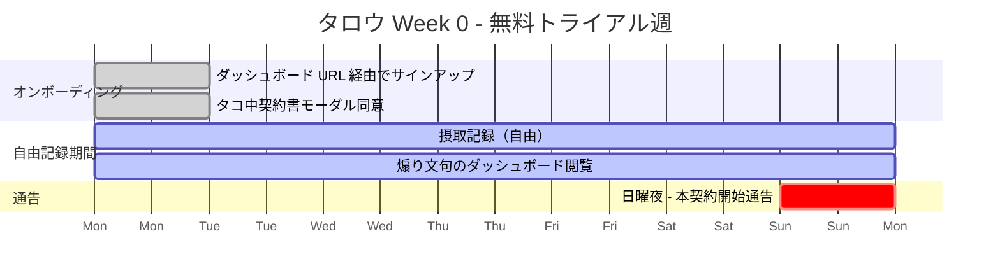
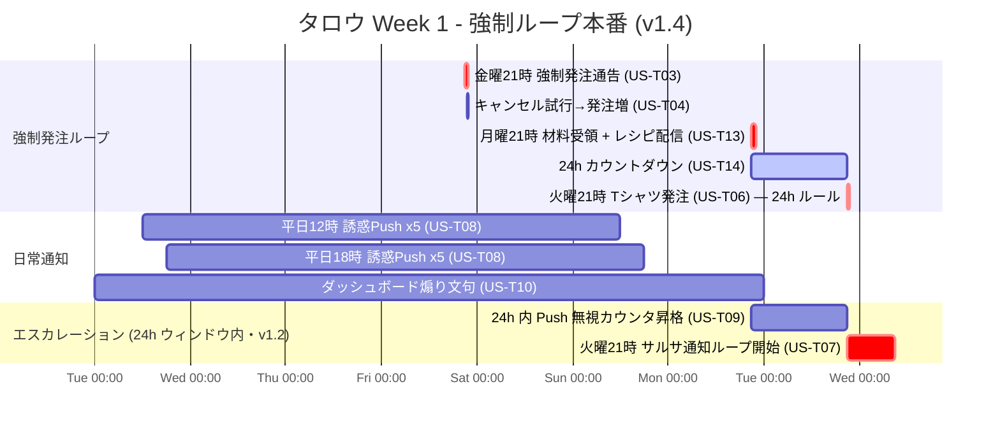
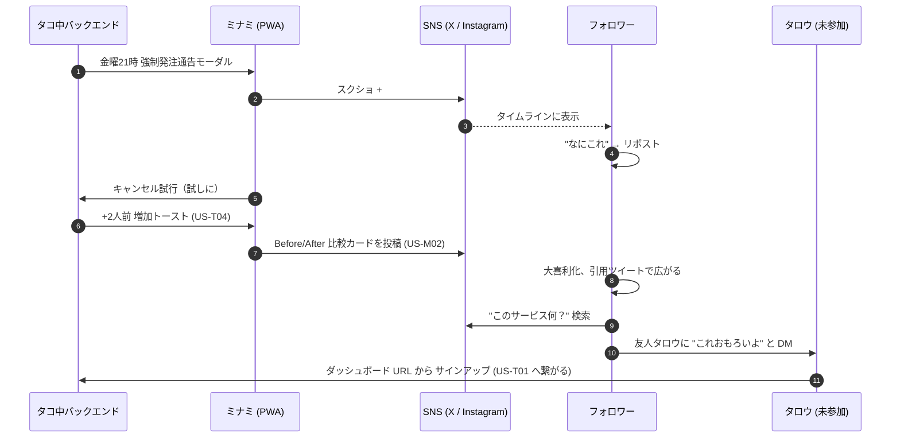

# Story Board: タコ中

**Project**: タコ中（たこちゅう）
**Document Version**: 2.0
**Created**: 2026-04-29
**Updated**:
- 2026-04-29 v1.1 — 要件 v1.5 / personas v1.1 を反映 — 「材料が届く + レシピ配信 + 24h カウントダウン」を Week 1 タイムラインに統合、ミナミの料理動画／罰投稿サイドタイムラインを拡張
- 2026-04-29 v1.2 — 要件 v1.6 反映。サルサ通知を 24h 超過と統合（Tシャツ罰と同タイミング）。Push エスカレーションカウンタを 24h ウィンドウ内に再定義
- 2026-04-29 v1.3 — 要件 v1.7 反映。**レシピ配信を Bedrock 動的生成からリポジトリ同梱の静的レシピ（手書き・キット種別 1:1）に変更**（食中毒リスク回避）。Bonus #4 の文言を訂正（「Bedrock 活用」は審査基準に含まれないため "AWS 活用 + AI-DLC プロセス成果 + テーマ適合性" に修正）。煽り文・誘惑 Push の Bedrock 動的生成は維持
- 2026-05-08 v1.4 — 要件 v1.8 / stories v1.4 / personas v1.2 を反映。**FR-6.3 廃止に伴い ChatGPT GPT 関連を全削除**: タロウ Week 1 ガントチャートの「AI会話」セクション削除、火曜 22:00 のタコ中 GPT 起動シーン削除、ミナミ Sequence diagram の ChatGPT 共有リンク投稿を削除、SNS シリーズ #3（GPT 説教モード共有）削除、タッチポイントマップから ChatGPT GPT 列を削除、§5.4 ChatGPT GPT 説教モード セクション削除、デモタイムライン #4 を削除
- 2026-05-08 v2.0 — **ビジネス意図深掘り（rework）** — §11「認知占有の体験弧（Week 0→4→12 長期依存アーク）」を新セクションとして追加。§1 目的に Taco Tuesday 文化移植ミッションを追記。既存セクション（§2〜§10）の構造は維持。
**Phase**: INCEPTION - Completed (2026-04-29 承認 / 2026-05-09 v2.0 rework 済み)
**Format**: テキスト + Mermaid ハイブリッド (Q18=D)
**Visual Language**: SVG イラスト + 大胆タイポ、絵文字なし、ポップ・カラフル (Clarification 3=D)
**Tone**: メキシコ風キャラクター（Q11=C）
**Escalation**: A → B → C 段階的（Q12=D）

---

## 1. ストーリーボードの目的

このドキュメントは User Stories ステージで定義した 16 ストーリー（`stories.md`）を、
**実際のユーザー体験のタイムラインとして俯瞰**し、UX 設計判断（タッチポイント／通知トーン／演出）の
判断軸を 1 ヶ所にまとめるためのものです。

ハッカソン審査員が最初に読む書類審査用ドキュメントとしても機能するよう、
**「タコ中を 1 週間使ったらどうなるか」**を物語として伝える構成にしています。

---

## 2. タロウの「依存される 2 週間」タイムライン

タロウは Week 0（無料トライアル）から Week 1（強制ループ本番）へ移行する。

### 2.1 Week 0: 無料トライアル週（緩やかな招待）



| 曜日 | 時刻 | 出来事 | チャネル | トーン |
|------|------|--------|---------|--------|
| 月 | 21:00 | サインアップ + トライアル開始 | Web (Cognito) | 事務的 |
| 月-日 | 終日 | 摂取記録の練習・ダッシュボード探索 | Web | ポップ |
| 金 | 21:00 | **強制発注は走らない**（トライアル除外） | （無音） | — |
| 日 | 22:00 | 翌日からの本契約開始通告 | フルスクリーンモーダル | メキシコ風（"アミーゴ、明日から本番だ"） |

### 2.2 Week 1: 強制ループ本番（v1.4 — 材料受け取り + 静的レシピ + 24h カウントダウン統合 / v1.4 で ChatGPT GPT 関連シーンを削除）



> **v1.4 注**: 旧「section AI会話」（火曜 22:00 タコ中 GPT 起動・説教モード）は FR-6.3 廃止に伴い削除済み。

**v1.1 追加ポイント**:
- 月曜 21:00: **材料受領 + 静的レシピ配信**（US-T13、リポジトリ同梱・キット種別 1:1） → 受動的に料理させられる
- 月曜 21:00 〜 火曜 21:00: **24 時間カウントダウン**（US-T14） → ダッシュボードに常時タイマー
- 火曜 21:00: 24h ルールで Tシャツ罰発火（US-T06、12h → 24h に変更）

**v1.2 追加ポイント**:
- 火曜 21:00 のチェックポイントで **Tシャツ罰（US-T06）+ サルサ通知ループ（US-T07）が同時発火**（旧 3 日ルール廃止）
- Push 無視によるエスカレーションカウンタは月〜火の 24h ウィンドウ内のみ集計（US-T09）。ユーザーは「自分の無視行動が 24h 内のトーン昇格に直接効く」と把握できる

### 2.3 タロウの 1 日の介入リズム（典型的な火曜・v1.1）

```
07:00  起床 — スマホで未読 Push 確認
07:30  ダッシュボード閲覧
       → "今日の煽り文句" カード表示（US-T10）
       → 24h カウントダウンタイマー: 残り 13:30:00 と表示（US-T14）
       → "アミーゴ！残り 13 時間だ。冷蔵庫のパストール材料が眠っている。"
08:00  通勤替わりに業務開始（リモート）
       → タロウ: 朝食はいつものシリアル

12:00  昼の誘惑 Push（US-T08）
       → "アミーゴ！冷蔵庫のトルティーヤが待ってるぞ"
       → タロウ: 無視（仕事中）

15:00  カウントダウンタイマー残り 6 時間
       → ダッシュボード色がオレンジに（US-T14）
       → タロウ: ふと開いてしまう、ロゴが視界に焼き付く

18:00  夕の誘惑 Push（US-T08）
       → "アミーゴ、サルサが冷えていく前に動け"
       → タロウ: 無視

20:00  カウントダウン残り 1 時間 Push
       → "アミーゴ、残り 1 時間だ。Tシャツの発注書は既に印刷待ちだ" (US-T14)
       → タロウ: 仕方なく台所へ向かう。アミーゴ口調の静的レシピを開く（US-T13）
       → "アミーゴ、まずトルティーヤを温めるんだ。フライパンで両面 30 秒。"

20:45  パストール完成、TACO! ボタンを押す（US-T02）
       → カウントダウン停止、"アミーゴ、よくやった" バナー（US-T14）

23:30  就寝直前のダッシュボード確認
       → "今週の摂取: +1" と表示
```

> v1.0 では火曜朝 8:00 にチェックポイントが走り、Tシャツ罰が発動する流れだったが、**v1.1 では 24 時間ルール**に変わったため、タロウは月曜夜→火曜夜のあいだ常時カウントダウンに見られている状態になる。

---

## 3. ミナミの「バイラル波及 1 週間」サイドタイムライン

ミナミは**タコ中ユーザーであると同時に SNS 上の語り手**。タロウより 1 週間早く本契約に入った設定。
タロウが Week 0 のトライアル中、ミナミは Week 1 の強制ループを SNS に流す。



### 3.1 ミナミの SNS 投稿シリーズ（v1.1 - 5 連発）

| 投稿 # | タイミング | 内容 | 想定エンゲージメント |
|--------|----------|------|--------------------|
| #1 | 金曜 21:30 | 強制発注通告モーダルのスクショ + "アミーゴが勝手に来週の食卓決めてきた #タコ中" (US-M01) | リポスト 100+ |
| #2 | 金曜 21:35 | キャンセル押したら +2 人前 Before/After 比較画像 + "押したら増えた" (US-M02) | リポスト 500+、引用 50+ |
| ~~#3~~ | ~~土曜 11:00~~ | ~~タコ中 GPT 説教モードのスクショ + ChatGPT 共有リンク (US-M03)~~ → **v1.4 で削除** | — |
| **#4** | **月曜 22:00** | **材料受領 + レシピ字幕画像オーバーレイ → TikTok 30 秒料理動画 "勝手に届いた材料で作るシリーズ #6" (US-M04)** | **再生 5,000+、シリーズ化でフォロワー定着** |
| **#5** | **火曜 21:05** | **作らずに罰受け → "罰受けました" ヒーローカード共有 (US-M05)** | **「**罰受けました**」**シリーズとして連投化、リポスト 300+** |

**v1.1 ポイント**:
- 単発拡散（#1〜#3）から、**シリーズ化**された **#4 料理動画** + **#5 罰受けました**へ拡張
- ミナミは「タコ中ユーザーである自分」を**毎週コンテンツ化**でき、フォロワーが定期視聴する構造になる
- ハッカソン審査員へのアピールも「**バイラル単発**」から「**継続的なバイラル製造装置**」へとレベルアップ

---

## 4. タッチポイントマップ（朝・昼・夕・夜）

```
┌──────────────────────────────────────────────────────┐
│ 時間帯      │ Web Push (主)        │ Dashboard (能動) │
├─────────────┼──────────────────────┼──────────────────┤
│ 朝 7-9時    │ 火曜のみ Tシャツ通知 │ 今日の煽り文句   │
│ 昼 12時     │ 誘惑 Push            │ 必要時に確認     │
│ 夕 18時     │ 誘惑 Push            │ 必要時に確認     │
│ 夜 21-22時  │ 金曜は強制発注通告   │ 通告モーダル     │
│ 深夜        │ 24h ルール発動時のみ │ —                │
└─────────────┴──────────────────────┴──────────────────┘
```

**重心の確認**:
- **B（Web Push）が主タッチポイント**（Q8=B 反映）
- ダッシュボードは「自分から開いて確認する／記録する」能動チャネル
- v1.4 で ChatGPT GPT 列は削除済み（FR-6.3 廃止）

---

## 5. 通知トーン例文集（FR-6 用）

すべて**メキシコ風キャラクター**（Q11=C）でトーン統一。
キャラ名: **"アミーゴ・タコス"**（タコ中の語り部）。

### 5.1 Level A: 親しみ系（焦り少々）— 24h ウィンドウ内 Push 無視 0〜1 回

| シーン | 例文 |
|--------|------|
| 平日昼 12 時 | "アミーゴ！もう昼だぞ。トルティーヤが温まる音、聞こえるか？" |
| 平日夕 18 時 | "アミーゴ、夕方だ。今日のサルサ、まだ用意してないのか？" |
| ダッシュボード煽り | "おはよう、アミーゴ。今朝のタコスは何にする？" |
| 雨の日 | "アミーゴ、雨の日のカルニタス、罪深いほど旨いぞ" |

### 5.2 Level B: 強迫的・罪悪感を煽る — 24h ウィンドウ内 Push 無視 2〜3 回

| シーン | 例文 |
|--------|------|
| 平日昼 12 時 | "アミーゴ、君のサルサが冷えていく。これは罪だ" |
| 平日夕 18 時 | "アミーゴ、もう 12 時間サルサに触れてないな？冷蔵庫のトルティーヤが乾いていく音、聞こえるか？" |
| ダッシュボード煽り | "アミーゴ、君が逃げているのは食事じゃない。タコスからだ。" |

### 5.3 Level C: 擬人化的に責める — 24h ウィンドウ内 Push 無視 4 回以上（火曜 21:00 直前のサルサ通知文と整合）

| シーン | 例文 |
|--------|------|
| 平日昼 12 時 | "冷蔵庫のトルティーヤが泣いている。お前のサルサは固まり、ライムは萎れた。" |
| 平日夕 18 時 | "君が無視するたび、アミーゴの心は折れていく。今夜、タコスを作れ。さもなくば俺はもう何も言わない。" |
| ダッシュボード煽り | "アミーゴ・タコスは沈黙する。沈黙は最後の警告だ。" |

### ~~5.4 ChatGPT GPT 説教モード（FR-6.3）~~ → **v1.4 で削除**

> 要件 v1.8 で FR-6.3 をスコープから削除したため、本セクションは廃止。

---

## 6. UI コピー サンプル

### 6.1 強制発注通告モーダル（US-T03 / US-M01）

```
┌────────────────────────────────────────────┐
│                                            │
│         [SVG TACO ICON × 3]                │
│                                            │
│         今週の食卓、決定。                    │
│         ─────────────                       │
│                                            │
│         8人前  ×  PASTOR                   │
│                                            │
│         配送: 月曜 21:00                    │
│                                            │
│         キャンセルは できません。              │
│                                            │
│   [ 了解 ]            [ キャンセル要求 ]      │
│                                            │
└────────────────────────────────────────────┘
```

- **大胆タイポ**: "8人前", "PASTOR", "決定"
- **SVG イラスト**: タコス 3 個のアイコン
- **絵文字なし**（Clarification 3 反映）
- **配色**: ポップ・カラフル（オレンジ＋赤＋緑のメキシカンパレット）

### 6.2 キャンセル試行→発注増加トースト（US-T04 / US-M02）

```
┌─────────────────────────────────────────────┐
│  [SVG: increase arrow + taco]                │
│                                              │
│  キャンセル要求を承りました。                  │
│  お詫びとしてサービスで 2人前 を追加しました。  │
│                                              │
│  来週月曜、無事配送いたします。                 │
└─────────────────────────────────────────────┘

→ Before/After 比較カード（Share ボタン付き）

  [ 4人前 ] ─────→ [ 6人前  +2 ]
```

### 6.3 強制バリエーションウィーク発動モーダル（US-T12）

```
┌─────────────────────────────────────────────┐
│  [SVG: mango × 3 + dramatic background]      │
│                                              │
│   ★★★ 強制マンゴーウィーク ★★★               │
│                                              │
│   今週、すべての発注はマンゴー味です。           │
│                                              │
│   逃げ場は ありません。                        │
│                                              │
│   [ ファンファーレ音 effect.mp3 ]              │
└─────────────────────────────────────────────┘
```

### 6.4 24 時間カウントダウンタイマー（US-T14・新規）

```
┌─────────────────────────────────────────────┐
│  [SVG taco × 3]                              │
│                                              │
│   作るまで、あと                              │
│                                              │
│   13 : 30 : 12                               │
│                                              │
│   未着手の材料: PASTOR 4人前                   │
│                                              │
│   [ レシピを開く ]    [ TACO! を記録する ]      │
└─────────────────────────────────────────────┘

時刻別 UI 状態:
- 残り 24h 〜 7h:  通常配色 (緑～黄)
- 残り 6h 〜 1h:   オレンジ警告 + アイコン
- 残り 1h:        赤警告 + Push通知 "アミーゴ、残り 1 時間だ"
```

### 6.5 今週の調理ガイド（US-T13・新規）

```
┌─────────────────────────────────────────────┐
│  今週の調理ガイド                              │
│  ─────────────────                            │
│  PASTOR  ×  4人前    [Type A]                  │
│                                              │
│  アミーゴ、まずトルティーヤを温めるんだ。       │
│  フライパンで両面 30 秒、それ以上は焦げる。     │
│                                              │
│  1. パストールの肉をよく焼く（強火 5 分）       │
│  2. パイナップル少々を加えて旨みを出す        │
│  3. トルティーヤに肉、玉ねぎ、コリアンダー       │
│  4. ライムを 1 滴。それで完成だ、アミーゴ。    │
│                                              │
│  [ Share for video ] (TikTok / Reels 用)      │
└─────────────────────────────────────────────┘
```

### 6.6 "罰受けました" ヒーローカード（US-M05・新規）

```
┌─────────────────────────────────────────────┐
│  背景: 黒地                                   │
│                                              │
│         罰、受けました。                       │
│         ─────────────                          │
│                                              │
│         T-SHIRT ORDER #042                   │
│                                              │
│         [SVG: 黒地 TACO × 3 Tシャツ]            │
│                                              │
│         配送予定: 5/23 金曜                    │
│                                              │
│  [ Share ] (#タコ中 #罰受けました)              │
└─────────────────────────────────────────────┘
```

### 6.7 サルサ警告バナー（US-T07）

```
┌─────────────────────────────────────────────┐
│  [SVG: salsa jar + warning]   24h ウィンドウ超過 │
│                                              │
│  アミーゴ、サルサが鳴り続ける。                  │
│  今すぐ TACO ボタンを押せ。                     │
│                                              │
│  [ TACO! ボタン (大胆タイポ・大きめ) ]          │
└─────────────────────────────────────────────┘
```

### 6.8 ローディング・エラー文（FR-4 + Q16=A）

| 場面 | 文言 |
|------|------|
| ロード中 | "サルサ準備中..." / "トルティーヤを温めています..." |
| 一般エラー | "ハバネロ過多エラー。少し冷ましてから再試行してください。" |
| ネットワークエラー | "アミーゴ、メキシコまで電波が届かなかったようだ。再試行を。" |
| 認証エラー | "君は アミーゴ・タコスに 認証されていない。" |
| 摂取記録重複 | "タコス記録済み（1 分以内の重複は無視）" |

---

## 7. ハッカソン審査員に「刺さる瞬間」3 選（Q17=A,B,D + v1.1 追加）

審査員に最初に体験してほしい順番:

### #1: 金曜夜の強制発注通告モーダル（US-T03）
- フルスクリーンモーダル + ファンファーレ + メキシコ風通告
- **インパクト**: 「自分の食事を自分で決めない」コンセプトの体感
- **デモ手順**: トライアル中ユーザーで時計を金曜 21:00 に進める（モックスケジューラ）

### #2: サルサ通知が鳴り続ける瞬間（US-T07・v1.2）
- 24h カウントダウン超過シミュレーションで Tシャツ罰と同時にサルサ Web Push がループする
- **インパクト**: 「逃げ場のない世界」の体感、火曜 21:00 という固定時刻に集中する強制力
- **デモ手順**: 月曜 21:00 → 火曜 21:00 の時間を進めて 24h カウントダウンを超過させ、チェックポイント Lambda を発火

### #3: 「キャンセル不可」を試す瞬間（US-T04）
- キャンセル要求ボタンを押すと +2 人前されるシュール反応
- **インパクト**: 「人をダメにするサービス」テーマへのストレートな笑い
- **デモ手順**: US-T03 の通告モーダル → "キャンセル要求" → "OK" を押す

### Bonus #4 (v1.3 訂正): 24h カウントダウン + 静的アミーゴ口調レシピ表示（US-T13/T14）
- 月曜夜の材料受領 → リポジトリ同梱の手書きアミーゴ口調レシピが Push → カウントダウンが秒単位で減る
- **インパクト**: 「**タコスが生活の一部になる**」のコアコンセプトを最も雄弁に示す瞬間
- **デモ手順**: 時計を月曜 21:00 に進める → ダッシュボードでカウントダウン起動を見せる
- **ハッカソン審査基準への適合**: 「AI-DLC プロセスの実践と工夫」「創造性とテーマ適合性」「ドキュメント品質」を同時に体感させられる（※「Bedrock 活用」は規約上の審査基準ではないため、安全性・体験品質の観点から静的レシピを採用）

---

## 8. SVG イラスト・タイポ ガイド（Clarification 3=D）

### 8.1 必要な SVG イラスト一覧（最低限）
- `taco-icon.svg`: タコス 1 個アイコン（汎用）
- `taco-x3.svg`: タコス 3 個並びロゴ（Tシャツ柄と統一）
- `salsa-jar.svg`: サルサ瓶（警告用）
- `tortilla.svg`: トルティーヤ平面（背景・ローディング用）
- `mango.svg`: マンゴー（強制マンゴーウィーク用）
- `cancel-arrow-up.svg`: 上向き矢印 + タコス（キャンセル試行→発注増用）
- `kit-box.svg`: 材料セット箱（v1.1 - US-T13 用）
- `clock-countdown.svg`: タイマー枠（v1.1 - US-T14 用）
- `recipe-scroll.svg`: レシピ巻物（v1.1 - 調理ガイドカード用）

### 8.2 タイポグラフィルール
- **見出し（数字／キーワード）**: 極大サイズ（48〜72pt）、太字、メキシカンパレット色
- **本文**: 16pt、可読性重視
- **キャラクター語り**: イタリック気味、見出し直下に短く配置
- **数字（人前数・日数）**: タイポを最大化、UI のフォーカス点

### 8.3 配色（ポップ・カラフル、絵文字なし）
- 基本背景: オフホワイト #FAF7F2
- アクセント 1（メキシカンレッド）: #D62828
- アクセント 2（ライムグリーン）: #6BBF59
- アクセント 3（マスタードイエロー）: #F4A261
- 警告色（サルサ警告）: #E63946
- 説教モード背景: #2B2B2B（黒地、Tシャツと整合）
- 通常テキスト: #1F1F1F

---

## 9. プレゼンテーション ストーリー（決勝向け参考・v1.1）

決勝（6/26）プレゼンの 15 分構成案:

| 時間 | 内容 |
|------|------|
| 0-1 分 | "タコスは偉大だ" タイトル + コンセプト紹介（**タコスが生活の一部になる** / ヘルスケア逆張り） |
| 1-3 分 | ペルソナ「タロウ」「ミナミ」紹介、なぜ 2 人なのか |
| 3-5 分 | デモ #1: 金曜の強制発注通告（US-T03） |
| 5-7 分 | デモ #2: 月曜夜 — 材料受領 + 静的アミーゴ口調レシピ + 24h カウントダウン（US-T13/T14） |
| 7-9 分 | デモ #3: キャンセル試行→発注増（US-T04） |
| 9-11 分 | デモ #4: 24h ウィンドウ内 Push エスカレーション Level A→C（US-T08 / US-T09） |
| 11-13 分 | AI-DLC プロセスの実践と工夫（aidlc-docs を引用） |
| 13-14 分 | バイラル仕掛け（ミナミの SNS 投稿シリーズ #1, #2, #4, #5、料理動画と罰受けましたシリーズ。v1.4 で #3 ChatGPT 共有を削除） |
| 14-15 分 | 結び: "AI は欲を予測しない、生成し煽り、台所まで侵食する" |

---

## 10. Plan Outline 進捗（再確認）

`story-generation-plan.md` の Plan Outline で本ファイル該当の Step は完了:

- [x] Step J: `story-board.md` 生成（本ファイル）
- [x] Step K: タッチポイント図作成（4 章）
- [x] Step L: 通知トーン・キャラクター性の例文集（5 章 / Level A→B→C）
- [x] Step M: 強制発注通告／シュール演出のサンプル UI コピー（6 章。v1.4 で「説教モード」言及削除）

これで User Stories Part 2 の全 Step が完了（v1.4、2026-04-29 ユーザー承認済み）。後続ステージ（Workflow Planning v1.4 / Application Design v1.1 / Units Generation v1.1）も全て完了済み。次フェーズは CONSTRUCTION（Per-Unit Loop）。

---

## 11. 認知占有の体験弧（Week 0 → Week 4 → Week 12）【新規・v2.0】

**「Taco Tuesday を日本に根付かせる」** という文化移植ミッションは、1 週間の体験だけでは測れない。
このセクションは、タロウが **3 ヶ月（12 週）かけて段階的に "頭の中にタコスが住み着いていく"** プロセスを長期アークとして可視化する。

> **「人をダメにする」の本質 = 認知の占有**
> 3 ヶ月後に「最高じゃないですか」と感じる幸せな降伏は、この体験弧を経て完成する。

---

### 11.1 長期依存アーク図（Week 0 → 12）

```
認知占有レベル（タコスが頭に住み着いている度）

100% ────────────────────────────────── "最高じゃないですか"（Week 12）
      ↑                                        ↑
      |                          ┌─────────────┤ 自発的 Taco Tuesday 登場
      |                          |              (外圧なしにタコスを作る)
      |              ┌───────────┤
      |              |           | Week 8+: 週次 Taco Tuesday が当たり前
      |    ┌─────────┤           | Push を待たずにダッシュボードを開く
      |    |         | Week 4: 火曜日が近づくと "不安" を感じ始める
      |    |         | 24h カウントダウンの恐怖が刷り込まれている
  10% |    | Week 0-1: 「面白いサービス試してみた」
      |    | 外圧のみで動く（プッシュ通知が来れば作る）
   0% └────┴──────────────────────────────────────────→ 週数
        0      1-2      3-4      5-8      9-12
```

---

### 11.2 フェーズ別タロウの内的状態変化

| フェーズ | 週数 | 認知状態 | 行動パターン | キーワード |
|---------|------|---------|------------|-----------|
| **Phase 0: 好奇心** | Week 0-1 | タコスは外から来るもの | Push が来てから動く、外圧依存 | 「面白いサービス試してみた」 |
| **Phase 1: 刷り込み** | Week 2-3 | Push の予感が頭に芽生える | 昼 12:00 が近づくとスマホを確認し始める | 「なんか通知来るんじゃないかな」 |
| **Phase 2: 占有開始** | Week 4-6 | 火曜日の存在が特別になる | 火曜 21:00 が近づくと少し不安になる | 「まだ作ってないや…（US-T14 Pain Point）」 |
| **Phase 3: 習慣化** | Week 7-10 | タコス = 火曜日のデフォルト | 月曜夜に自然と材料を確認する | 「来週は何が届くかな」 |
| **Phase 4: 文化定着** | Week 11-12 | タコスなしの火曜日は変な感じ | Push を待たずに自発的に「TACO!」ボタンを押す | **「最高じゃないですか」（US-T15）** |

---

### 11.3 Week 別 タッチポイント × 認知占有イベント

```mermaid
gantt
    title 認知占有の体験弧（Week 0 → 12）
    dateFormat YYYY-MM-DD
    axisFormat Week %W

    section Phase 0: 好奇心
    トライアル開始・外圧のみで動く     :done, p0, 2026-05-04, 14d

    section Phase 1: 刷り込み
    Push のリズムが体に染み込み始める   :active, p1, 2026-05-18, 14d

    section Phase 2: 占有開始
    火曜 21:00 の不安が芽生える        :crit, p2, 2026-06-01, 21d

    section Phase 3: 習慣化
    週次リズムが自動化していく          :active, p3, 2026-06-22, 21d

    section Phase 4: 文化定着
    自発的 Taco Tuesday の誕生         :done, p4, 2026-07-13, 14d
```

---

### 11.4 認知占有の 3 つのメカニズム

タロウの「頭にタコスが住み着く」プロセスは、以下の 3 メカニズムが重なって発生する:

#### メカニズム A: **時間の刷り込み**（FR-1.2, FR-6.2）
```
Week 1: 昼 12:00・夕 18:00 に Push が来る → 時刻とタコスが結びつく
Week 4: 昼 12:00 が来ると無意識にスマホを手に取る
Week 8: 火曜日という曜日そのものがタコスを連想させる
```

#### メカニズム B: **場所の侵食**（FR-2.3, FR-4）
```
Week 1: 冷蔵庫に材料が入っている → キッチンに近づくとタコスを思い出す
Week 4: ダッシュボードを開く習慣ができる → スマホとタコスが繋がる
Week 8: 食料品店に行くと「トルティーヤあるかな」と考える
```

#### メカニズム C: **不安と報酬のループ**（FR-1.1, FR-6.4）
```
Week 1: 作らないとサルサ通知が来る（不安）→ 作ると止まる（報酬）
Week 4: Push が来る前から「作らなければ」という予期不安が生まれる
Week 8: タコスを作ることが「ノルマ達成感」として気持ちよくなる
Week 12: 外圧なしにタコスを作ることが "自分の火曜日" になる
```

---

### 11.5 Week 12 の達成状態（US-T15 の体験的描写）

> 12 週間後の火曜日、朝 9:00 の Push が来る前に、タロウはダッシュボードを開いている。
>
> 先週届いたカルニタス材料は冷蔵庫にある。レシピはもう覚えた。
> 今日は 20:00 に台所に立てばいい。それだけだ。
>
> **通知が来るから作るのではない。火曜日だから作るのだ。**
>
> 「最高じゃないですか。」
>
> — これが、タコ中が目指す文化移植の完成形。Taco Tuesday が一人の日本人の生活に根付いた瞬間。

---

### 11.6 ミナミの文化移植への貢献（フォロワーへの伝播）

ミナミの SNS 活動は、タロウ個人の体験弧を**社会全体へ拡張する伝播路**として機能する:

```
ミナミの投稿 (毎週火曜)
    │
    ├── US-M01: 「今週のタコ中通告 #TacoTuesday」
    │         → フォロワー 12,000 人が週次で「火曜日 + タコス」を見る
    │
    ├── US-M04: 「Taco Tuesday 動画シリーズ Week N」
    │         → 視聴者の脳内で「火曜日 = タコスを作る日」の連想が形成される
    │
    └── US-M05: 「罰受けました #タコ中」
              → 笑いながら「人をダメにする」仕組みを理解し、興味を持つ

フォロワーの行動変化（3 ヶ月後）:
  ・毎週火曜にミナミのタコス投稿を楽しみにしている
  ・「火曜日はタコスの日（ミナミの日）」として認識し始める
  ・タコ中に興味を持つユーザーが周辺から生まれる
  → Taco Tuesday の日本への文化移植が、ミナミを介して始まっている
```

---

### 11.7 ハッカソン審査員向け: 「人をダメにする」の長期的意味

このセクションが示す通り、タコ中における「人をダメにする」は:

| 次元 | 内容 |
|------|------|
| **短期（Week 0-1）** | 外圧による行動変容（強制 Push・罰） |
| **中期（Week 2-6）** | 認知の占有開始（頭の中にタコスが住み着く） |
| **長期（Week 7-12）** | 文化的受容（Taco Tuesday が生活リズムとして定着） |
| **社会的（ミナミ経由）** | Taco Tuesday の日本文化への移植 |

**「最高じゃないですか」は、強制から始まった依存が、最終的に幸せな文化になる瞬間を指している。**

これがタコ中の「人をダメにする」の本質的な意味であり、AWS AI-DLC ハッカソンテーマへの正面回答である。
